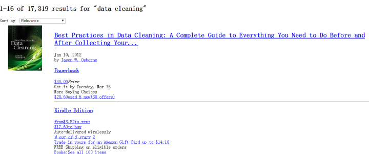
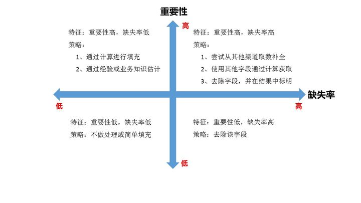

转自 <https://zhuanlan.zhihu.com/p/20571505>

## ETL数据处理过程

数据清洗， 是整个数据分析过程中不可缺少的一个环节，其结果质量直接关系到模型效果和最终结论。在实际操作中，数据清洗通常会占据分析过程的50%—80%的时间。国外有些学术机构会专门研究如何做数据清洗，相关的书籍也不少。

如：

美亚 [data cleaning](https://www.amazon.com/Best-Practices-Data-Cleaning-Everything/dp/1412988012) 价值 `$75`

我将在这篇文章中，尝试非常浅层次的梳理一下数据清洗过程，供各位参考。

照例，先上图：

## **预处理阶段**

预处理阶段主要做两件事情：

* 一是将数据导入处理工具。通常来说，建议使用数据库，单机跑数搭建MySQL环境即可。如果数据量大（千万级以上），可以使用文本文件存储+Python操作的方式。
* 二是看数据。这里包含两个部分：**一是看元数据**，包括字段解释、数据来源、代码表等等一切描述数据的信息；**二是抽取一部分数据**，使用人工查看方式，对数据本身有一个直观的了解，并且初步发现一些问题，为之后的处理做准备。

## **第一步：缺失值清洗**

缺失值是最常见的数据问题，处理缺失值也有很多方法，我建议按照以下四个步骤进行：

* **1、确定缺失值范围：** 对每个字段都计算其缺失值比例，然后按照缺失比例和字段重要性，分别制定策略，可用下图表示：
    
* **2、去除不需要的字段：** 这一步很简单，直接删掉即可……但强烈建议清洗每做一步都备份一下，或者在小规模数据上试验成功再处理全量数据，不然删错了会追悔莫及（多说一句，写SQL的时候delete一定要配where！）。
* **3、填充缺失内容：** 某些缺失值可以进行填充，方法有以下三种：

  * 以业务知识或经验推测填充缺失值
  * 以同一指标的计算结果（均值、中位数、众数等）填充缺失值
  * 以不同指标的计算结果填充缺失值

    前两种方法比较好理解。关于第三种方法，举个最简单的例子：年龄字段缺失，但是有屏蔽后六位的身份证号，so……

* **4、重新取数：** 如果某些指标非常重要又缺失率高，那就需要和取数人员或业务人员了解，是否有其他渠道可以取到相关数据。

    以上，简单的梳理了缺失值清洗的步骤，但其中有一些内容远比我说的复杂，比如填充缺失值。很多讲统计方法或统计工具的书籍会提到相关方法，有兴趣的各位可以自行深入了解。

## **第二步：格式内容清洗**

如果数据是由系统日志而来，那么通常在格式和内容方面，会与元数据的描述一致。而如果数据是由人工收集或用户填写而来，则有很大可能性在格式和内容上存在一些问题，简单来说，格式内容问题有以下几类：

* **1、时间、日期、数值、全半角等显示格式不一致**

    这种问题通常与输入端有关，在整合多来源数据时也有可能遇到，将其处理成一致的某种格式即可。

* **2、内容中有不该存在的字符**

    某些内容可能只包括一部分字符，比如身份证号是数字+字母，中国人姓名是汉字（赵C这种情况还是少数）。最典型的就是头、尾、中间的空格，也可能出现姓名中存在数字符号、身份证号中出现汉字等问题。这种情况下，需要以半自动校验半人工方式来找出可能存在的问题，并去除不需要的字符。

* **3、内容与该字段应有内容不符**

  * 姓名写了性别，身份证号写了手机号等等，均属这种问题。 但该问题特殊性在于：并不能简单的以删除来处理，因为成因有可能是人工填写错误，也有可能是前端没有校验，还有可能是导入数据时部分或全部存在列没有对齐的问题，因此要详细识别问题类型。

  * 格式内容问题是比较细节的问题，但很多分析失误都是栽在这个坑上，比如跨表关联或VLOOKUP失败（多个空格导致工具认为“陈丹奕”和“陈 丹奕”不是一个人）、统计值不全（数字里掺个字母当然求和时结果有问题）、模型输出失败或效果不好（数据对错列了，把日期和年龄混了，so……）。因此，请各位务必注意这部分清洗工作，尤其是在处理的数据是人工收集而来，或者你确定产品前端校验设计不太好的时候……

## **第三步：逻辑错误清洗**

这部分的工作是去掉一些使用简单逻辑推理就可以直接发现问题的数据，防止分析结果走偏。主要包含以下几个步骤：

* **1、去重**

  * 有的分析师喜欢把去重放在第一步，但我强烈建议把去重放在格式内容清洗之后，原因已经说过了（多个空格导致工具认为“陈丹奕”和“陈 丹奕”不是一个人，去重失败）。而且，并不是所有的重复都能这么简单的去掉……

  * 我曾经做过电话销售相关的数据分析，发现销售们为了抢单简直无所不用其极……举例，一家公司叫做“ABC管家有限公司“，在销售A手里，然后销售B为了抢这个客户，在系统里录入一个”ABC官家有限公司“。你看，不仔细看你都看不出两者的区别，而且就算看出来了，你能保证没有”ABC官家有限公司“这种东西的存在么……这种时候，要么去抱RD大腿要求人家给你写模糊匹配算法，要么肉眼看吧。

  * 上边这个还不是最狠的，请看下图：
    
  * 你用的系统里很有可能两条路都叫八里庄路，敢直接去重不？（附送去重小tips：两个八里庄路的门牌号范围不一样）
  * 当然，如果数据不是人工录入的，那么简单去重即可。
* **2、去除不合理值**

  * 一句话就能说清楚：有人填表时候瞎填，年龄200岁，年收入100000万（估计是没看见”万“字），这种的就要么删掉，要么按缺失值处理。这种值如何发现？提示：可用但不限于箱形图（Box-plot）.

* **3、修正矛盾内容**

  * 有些字段是可以互相验证的，举例：身份证号是1101031980XXXXXXXX，然后年龄填18岁，我们虽然理解人家永远18岁的想法，但得知真实年龄可以给用户提供更好的服务啊（又瞎扯……）。在这种时候，需要根据字段的数据来源，来判定哪个字段提供的信息更为可靠，去除或重构不可靠的字段。

  * 逻辑错误除了以上列举的情况，还有很多未列举的情况，在实际操作中要酌情处理。另外，这一步骤在之后的数据分析建模过程中有可能重复，因为即使问题很简单，也并非所有问题都能够一次找出，我们能做的是使用工具和方法，尽量减少问题出现的可能性，使分析过程更为高效。

## **第四步：非需求数据清洗**

这一步说起来非常简单：把不要的字段删了。

但实际操作起来，有很多问题，例如：

* 把看上去不需要但实际上对业务很重要的字段删了；
* 某个字段觉得有用，但又没想好怎么用，不知道是否该删；
* 一时看走眼，删错字段了。

前两种情况我给的建议是：如果数据量没有大到不删字段就没办法处理的程度，那么能不删的字段尽量不删。第三种情况，请勤备份数据……

## **第五步：关联性验证**

* 如果你的数据有多个来源，那么有必要进行关联性验证。例如，你有汽车的线下购买信息，也有电话客服问卷信息，两者通过姓名和手机号关联，那么要看一下，同一个人线下登记的车辆信息和线上问卷问出来的车辆信息是不是同一辆，如果不是（别笑，业务流程设计不好是有可能出现这种问题的！），那么需要调整或去除数据。

* 严格意义上来说，这已经脱离数据清洗的范畴了，而且关联数据变动在数据库模型中就应该涉及。但我还是希望提醒大家，多个来源的数据整合是非常复杂的工作，一定要注意数据之间的关联性，尽量在分析过程中不要出现数据之间互相矛盾，而你却毫无察觉的情况。

* 以上，就是我对数据清洗过程的一个简单梳理。由于能力所限，难免挂一漏万，请各位不吝赐教，感谢。
