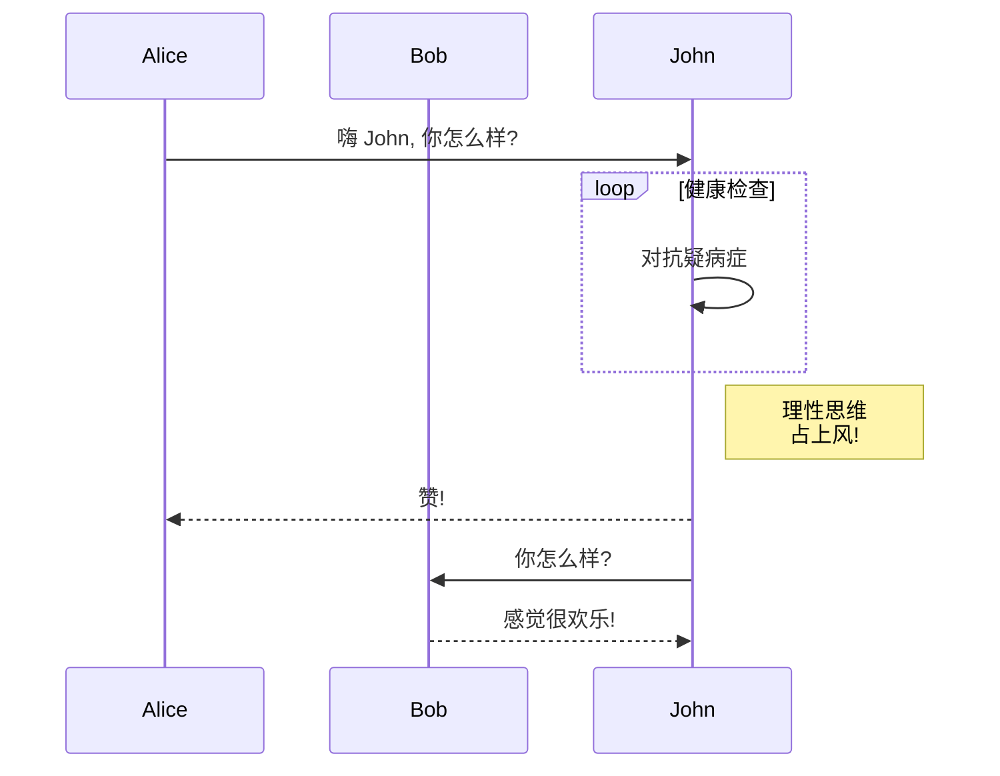
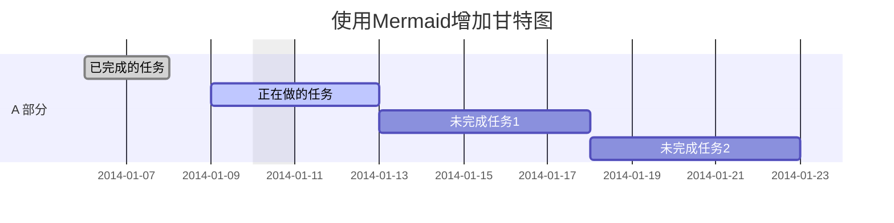
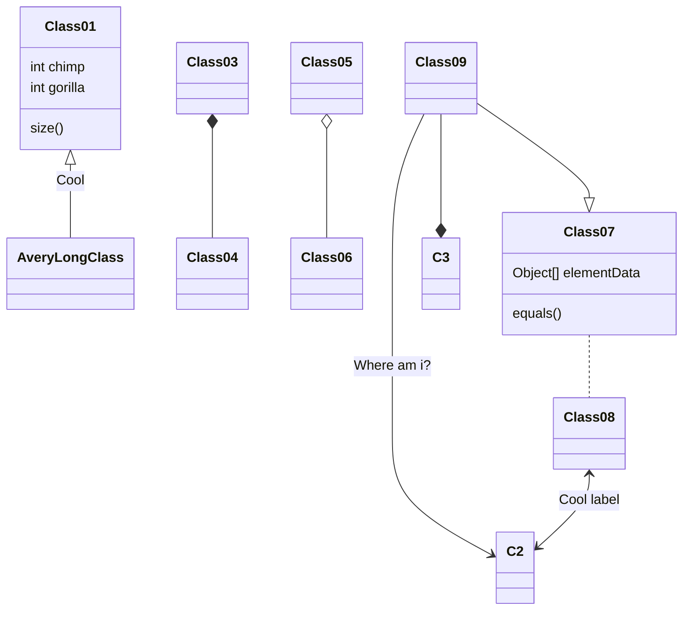
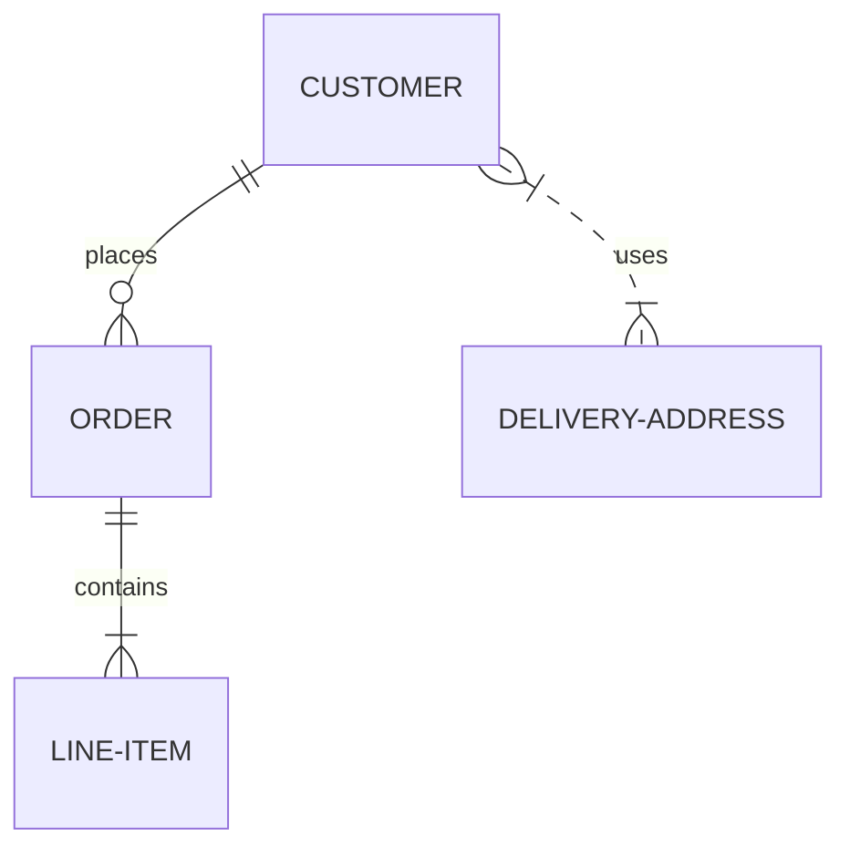
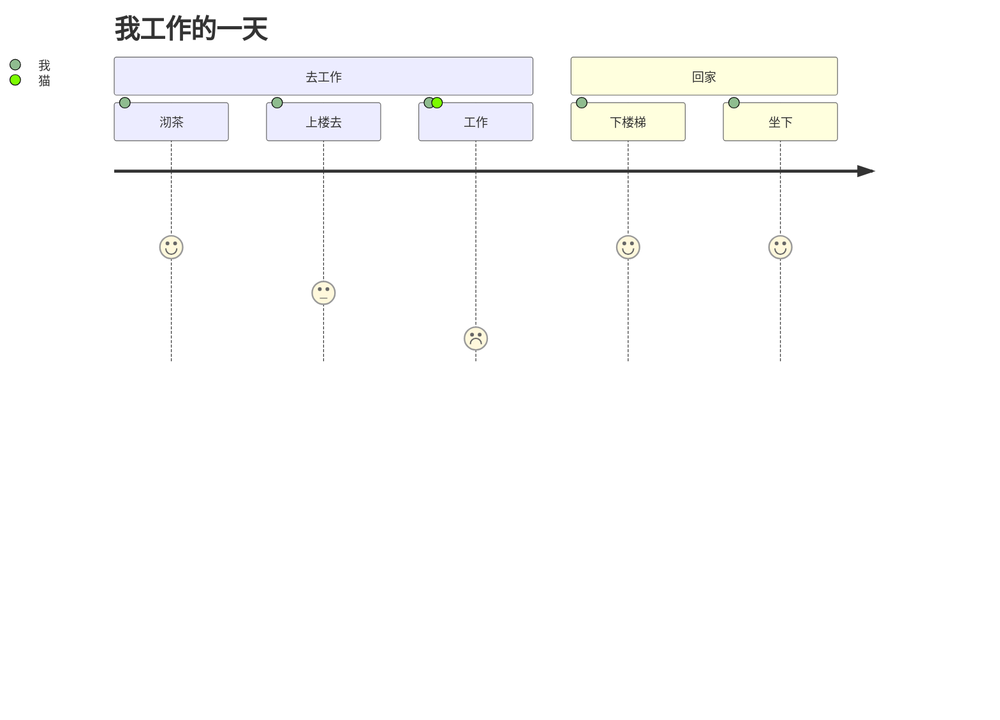

官方文档: <https://mermaid-js.github.io/mermaid/#/README>
基于版本: <https://github.com/mermaid-js/mermaid/tree/8.13.1>

## 简介

**Mermaid 可以使用文本和代码创建图表和可视化.**

Mermaid是一种基于 Javascript 的图表和图表工具，可呈现受 Markdown 启发的文本定义以动态创建和修改图表。

>如果你熟悉 Markdown，那么学习 [Mermaid的语法][Mermaid的语法] 应该没有问题.

[Mermaid的语法]: #Mermaid语法


[](https://travis-ci.org/mermaid-js/mermaid) [](https://www.npmjs.com/package/mermaid) [](https://coveralls.io/github/mermaid-js/mermaid?branch=master) [](https://join.slack.com/t/mermaid-talk/shared_invite/enQtNzc4NDIyNzk4OTAyLWVhYjQxOTI2OTg4YmE1ZmJkY2Y4MTU3ODliYmIwOTY3NDJlYjA0YjIyZTdkMDMyZTUwOGI0NjEzYmEwODcwOTE) [](https://percy.io/Mermaid/mermaid)

<!-- Mermaidn book banner -->
[](https://mermaid-js.github.io/mermaid/landing/)

<!-- <Main description> -->
Mermaid 的主要目的是帮助可视化文档，并帮助它赶上开发。
> Documentation-Rot 是 Mermaid 帮助解决的 Catch-22。

图表和文档花费了宝贵的开发人员时间并且很快就会过时。
然而，没有图表或文档会破坏生产力并阻碍组织学习。

Mermaid 通过减少创建可修改图表和图表所需的时间、精力和工具来解决这种 Catch-22 情况，从而产生更智能、更可重用的内容。
Mermaid 作为基于文本的图表工具，可以快速轻松地进行更新，并使文档变得更加容易。 它也可以根据需要包含在生产脚本和其他代码段中。

> Mermaid 是一款适合所有人的绘图工具。

即使是非程序员也可以通过[Mermaid在线编辑器](https://github.com/mermaid-js/mermaid-live-editor) 制作图表，请访问[教程页面](./Tutorials.md) 观看编辑器直播视频教程。

许多编辑器、维基和其他工具也有Mermaid集成和插件，可以轻松开始使用Mermaid。 [简单开始编写图表](./n00b-gettingStarted.md) 中描述了其中一些。

更详细的美人鱼介绍和它的一些基本用法，请参考[初学者概述](./n00b-overview.md)和[用法](./usage.md)。

🌐 [CDN](https://unpkg.com/mermaid/) | 📖 [文档](https://mermaidjs.github.io) | 🙌 [参与共享](https://github.com/mermaid-js/mermaid/blob/develop/docs/development.md) | 📜 [版本日志](./CHANGELOG.md) | 🔌 [插件](./integrations.md)

> 🖖 Mermaid想要保持稳定的更新频率：需要更多的合作者， [阅读更多](https://github.com/knsv/mermaid/issues/866).

🏆 **Mermaid 被提名并获得 [JS 开源奖](https://osawards.com/javascript/#nominees)（2019 年）“最令人兴奋的技术使用”类别！！！**

**感谢所有参与者，提交pull request的人，回答问题的人，特别感谢帮助我维护项目的 Tyler Long 🙏.**

## 图表类型

### 流程图 - [Flowchart](./flowchart.md?id=flowcharts-basic-syntax)

```mmd
graph TD;
    A-->B;
    A-->C;
    B-->D;
    C-->D;
```


### 时序图 - [Sequence diagram](./sequenceDiagram.md)

```mmd
sequenceDiagram
    participant Alice
    participant Bob
    Alice->>John: Hello John, how are you?
    loop Healthcheck
        John->>John: Fight against hypochondria
    end
    Note right of John: Rational thoughts <br/>prevail!
    John-->>Alice: Great!
    John->>Bob: How about you?
    Bob-->>John: Jolly good!
```



### 甘特图 - [Gantt diagram](./gantt.md)

```mmd
gantt
dateFormat  YYYY-MM-DD
title 使用Mermaid增加甘特图
excludes weekdays 2014-01-10

section A 部分
已完成的任务            :done,    des1, 2014-01-06,2014-01-08
正在做的任务               :active,  des2, 2014-01-09, 3d
未完成任务1               :         des3, after des2, 5d
未完成任务2               :         des4, after des3, 5d
```



### 类图 - [Class diagram](./classDiagram.md)

```mmd
classDiagram
Class01 <|-- AveryLongClass : Cool
Class03 *-- Class04
Class05 o-- Class06
Class07 .. Class08
Class09 --> C2 : Where am i?
Class09 --* C3
Class09 --|> Class07
Class07 : equals()
Class07 : Object[] elementData
Class01 : size()
Class01 : int chimp
Class01 : int gorilla
Class08 <--> C2: Cool label
```



### git分支图 - Git graph - ！ 实验性的

```mmd
gitGraph:
options
{
    "nodeSpacing": 150,
    "nodeRadius": 10
}
end
commit
branch newbranch
checkout newbranch
commit
commit
checkout master
commit
commit
merge newbranch

```


### 实体关系图 - [Entity Relationship Diagram - ！ 实验性的](./entityRelationshipDiagram.md)

```mmd
erDiagram
    顾客 ||--o{ 订单 : 地点
    订单 ||--|{ 订单项 : 包含
    顾客 }|..|{ 邮寄地址 : 使用

```



### 用户旅程图 - [User Journey Diagram](./user-journey.md)

```mmd
journey
    title 我工作的一天
    section 去工作
      沏茶: 5: 我
      上楼去: 3: 我
      工作: 1: 我, 猫
    section 回家
      下楼梯: 5: 我
      坐下: 5: 我
```



## 安装

**可以在[入门][入门]和[使用][使用]中找到深入的指南和示例。**

[入门]: /n00b-gettingStarted "入门"
[使用]: /usage "使用"

**了解有关[mermaid的语法][Mermaid的语法]的更多信息也会有所帮助。**

### CDN

```http
https://unpkg.com/mermaid@<version>/dist/
```

选择一个版本:

将 `version` 替换为所需的版本号。.

最新版本: [https://unpkg.com/browse/mermaid@8.8.0/](https://unpkg.com/browse/mermaid@8.8.0/)

### 部署 Mermaid

部署 Mermaid:

1. 您将需要安装 node v16，其中包含 npm
2. 使用 npm 下载 yarn
3. 输入以下命令: `yarn add mermaid`
4. 然后，您可以使用此命令将 mermaid 添加为开发依赖项:
    `yarn add --dev mermaid`

### [Mermaid API](./Setup.md)

**要在没有捆绑器的情况下部署Mermaid，可以像这样在 HTML 中插入一个带有绝对地址和 `mermaidAPI` 调用的`script`标签:**

```html
<script src="https://cdn.jsdelivr.net/npm/mermaid/dist/mermaid.min.js"></script>
<script>mermaid.initialize({startOnLoad:true});</script>
```
**这样做将命令Mermaid解析器查找带有 `class="mermaid"` 的 `<div>` 标签。 Mermaid将尝试从这些标签中读取图表/图表定义并将它们呈现为 svg 图表。**

 **示例可以在[其他示例][其他示例]中找到**

[其他示例]: /examples "其他示例"

## 相关项目

- [Mermaid 在线编辑器](https://github.com/mermaid-js/mermaid-live-editor)
- [Mermaid 命令行](https://github.com/mermaid-js/mermaid-cli)
- [Mermaid Webpack Demo](https://github.com/mermaidjs/mermaid-webpack-demo)
- [Mermaid Parcel Demo](https://github.com/mermaidjs/mermaid-parcel-demo)

## 请求协助

事情堆积如山，我很难跟上。 如果我们能组建一个核心开发团队来配合Mermaid的未来发展，那就太好了。

作为该团队的一员，您将获得对存储库的写入权限，并在回答问题时代表项目。

我们可以一起继续工作，例如：

- 添加更多图表类型，比如：思维导图, ERT图, 等等。
- 改进现有图表。

如果您想参与，请不要犹豫与我联系！

## 参与贡献者

### 设置

```sh
yarn install
```

### 构建

```sh
yarn build:watch
```

### Lint

```sh
yarn lint
```

我们使用 [eslint](https://eslint.org/).
我们建议您安装[编辑器插件](https://eslint.org/docs/user-guide/integrations)以获取实时 lint 结果。

### 测试

```sh
yarn test
```
在浏览器中手动测试: 打开 `dist/index.html`

### 发布

对于有权这样做的人：

更新 `package.json`中的版本号.

```sh
npm publish
```

上面的命令在`dist`文件夹中生成文件并将它们发布到npmjs.org.

## 致谢

非常感谢 [d3](http://d3js.org/) 和 [dagre-d3](https://github.com/cpettitt/dagre-d3) 项目提供图形布局和绘图库！

还要感谢 [js-sequence-diagram](http://bramp.github.io/js-sequence-diagrams) 项目对序列图语法的使用。 感谢 Jessica Peter 的灵感和甘特图渲染的起点。

_Mermaid 由 Knut Sveidqvist 创建，用于简化文档。_

这是项目贡献者的完整列表： [contributors](https://github.com/knsv/mermaid/graphs/contributors).
