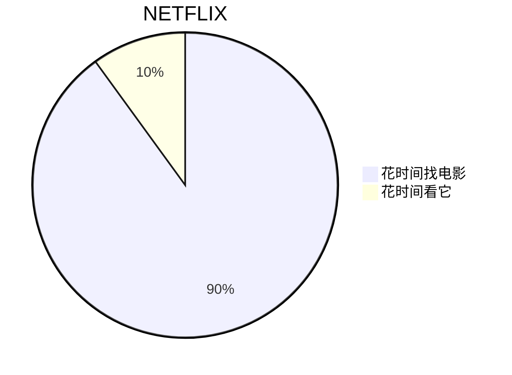
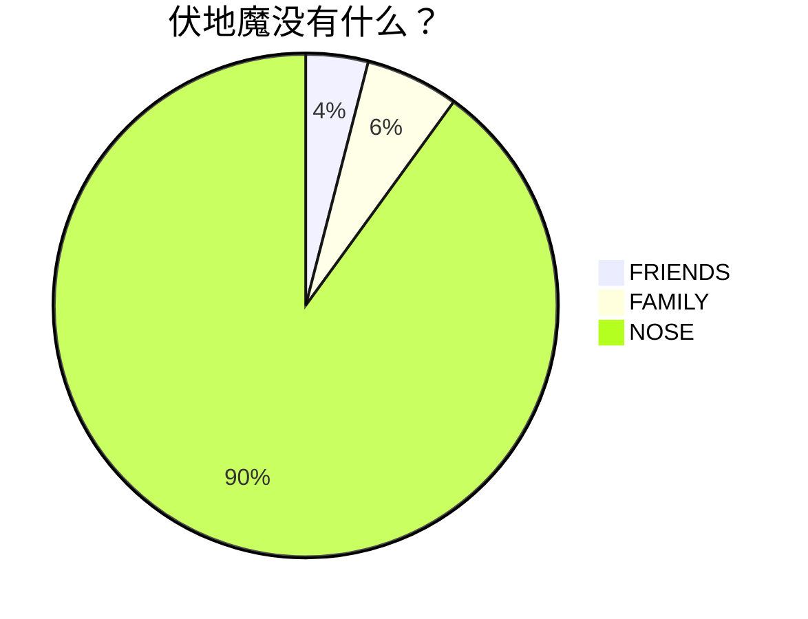
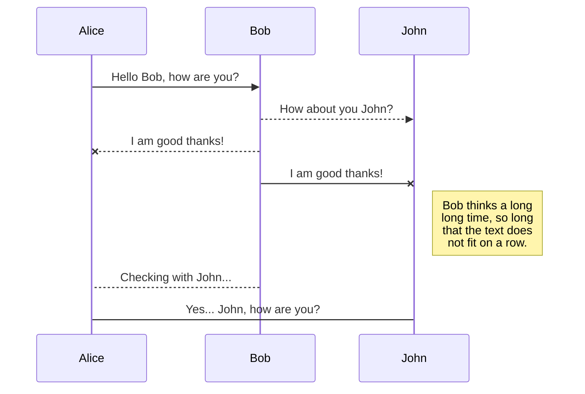
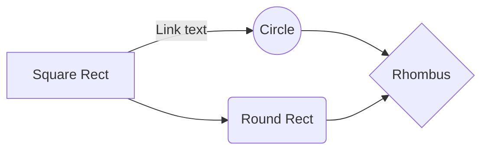
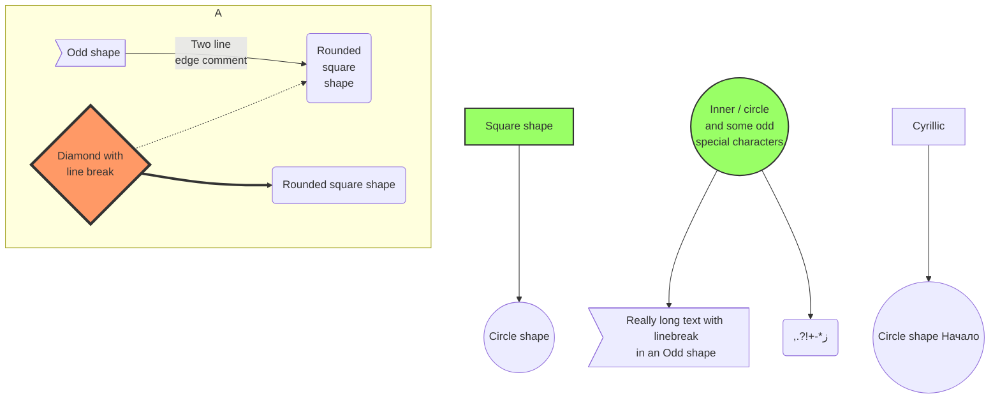
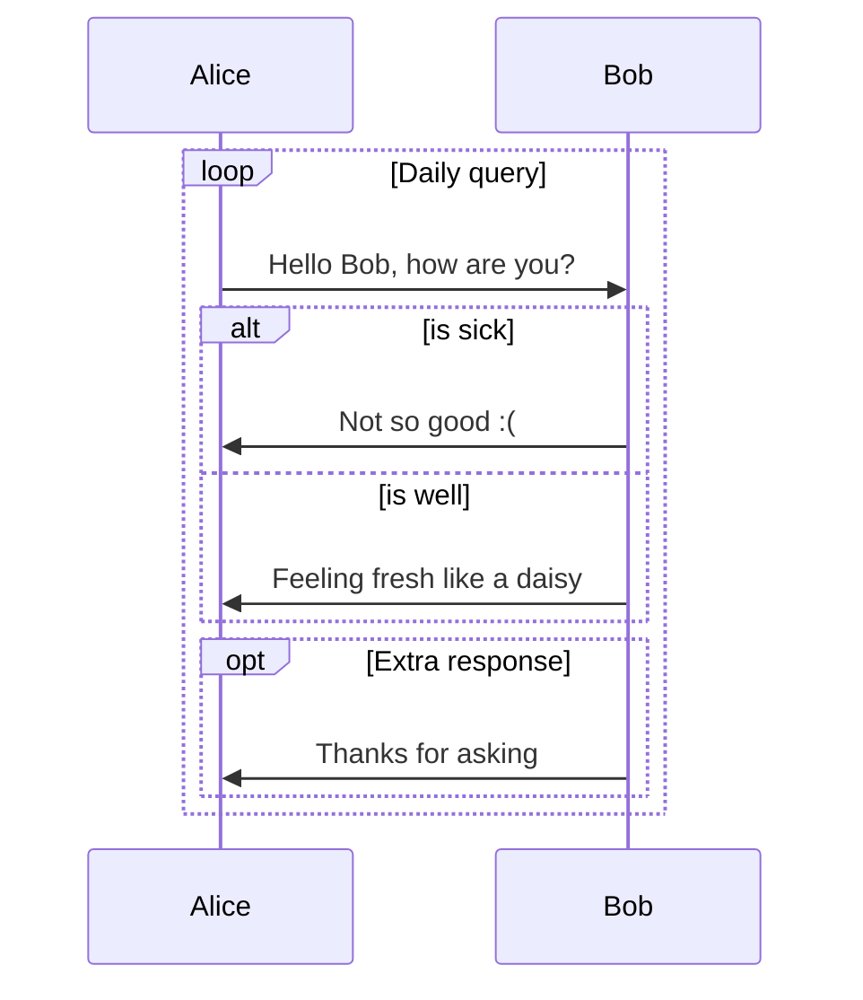
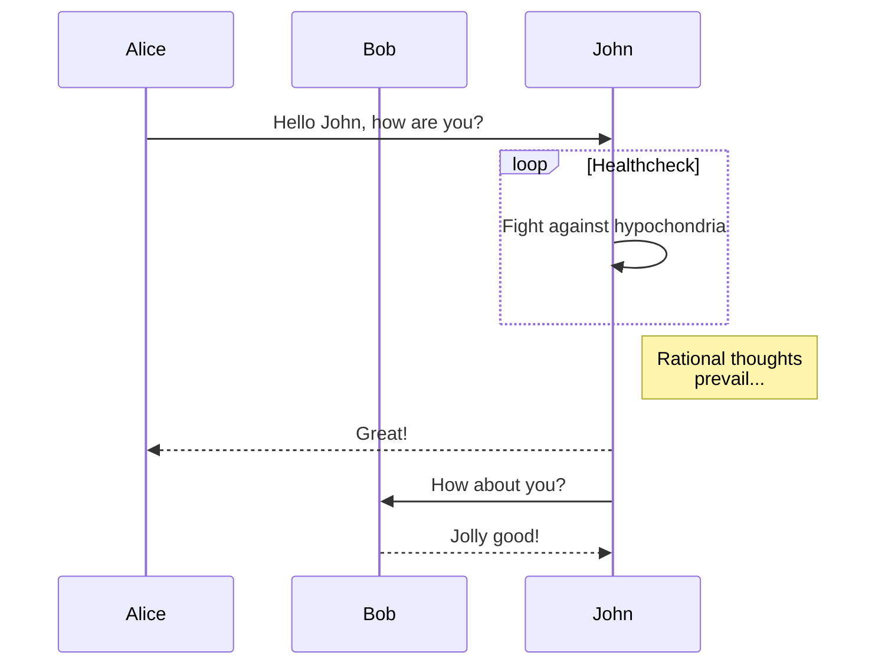

原文: <https://github.com/mermaid-js/mermaid/blob/develop/docs/examples.md>

## 样例

此页面包含可以通过Mermaid及其无数应用程序创建的图表和图表示例的集合。

This page contains a collection of examples of diagrams and charts that can be created through mermaid and its myriad applications.

**If you wish to learn how to support mermaid on your webpage, read the [Beginner's Guide](/usage?id=usage).**

**If you wish to learn about mermaid's syntax, Read the [Diagram Syntax](/flowchart?id=flowcharts-basic-syntax) section.**

## 基本饼图


pie title NETFLIX
  "花时间找电影" : 90
  "花时间看它" : 10



pie title 伏地魔没有什么？
  "FRIENDS" : 2
  "FAMILY" : 3
  "NOSE" : 45


### 基本序列图


sequenceDiagram
  Alice ->> Bob: Hello Bob, how are you?
  Bob-->>John: How about you John?
  Bob--x Alice: I am good thanks!
  Bob-x John: I am good thanks!
  Note right of John: Bob thinks a long long time, so long that the text does not fit on a row.

  Bob-->Alice: Checking with John...
  Alice->John: Yes... John, how are you?


### 基本流程图


graph LR
    A[Square Rect] -- Link text --> B((Circle))
    A --> C(Round Rect)
    B --> D{Rhombus}
    C --> D


### 带样式的流程图


graph TB
  sq[Square shape] --> ci((Circle shape))

  subgraph A
      od>Odd shape]-- Two line edge comment --> ro
      di{Diamond with   line break} -.-> ro(Rounded square shape)
      di==>ro2(Rounded square shape)
  end

  %% Notice that no text in shape are added here instead that is appended further down
  e --> od3>Really long text with linebreak in an Odd shape]

  %% Comments after double percent signs
  e((Inner / circle and some odd  special characters)) --> f(,.?!+-*ز)

  cyr[Cyrillic]-->cyr2((Circle shape Начало));

  classDef green fill:#9f6,stroke:#333,stroke-width:2px;
  classDef orange fill:#f96,stroke:#333,stroke-width:4px;
  class sq,e green
  class di orange


### 序列图: 循环, 判断 和 分支


sequenceDiagram
  loop Daily query
    Alice->>Bob: Hello Bob, how are you?
    alt is sick
        Bob->>Alice: Not so good :(
    else is well
        Bob->>Alice: Feeling fresh like a daisy
    end
    opt Extra response
        Bob->>Alice: Thanks for asking
    end
  end


### 序列图: 循环中标注消息


sequenceDiagram
    participant Alice
    participant Bob
    Alice->>John: Hello John, how are you?
    loop Healthcheck
        John->>John: Fight against hypochondria
    end
    Note right of John: Rational thoughts prevail...
    John-->>Alice: Great!
    John->>Bob: How about you?
    Bob-->>John: Jolly good!


