原文: <https://github.com/mermaid-js/mermaid/blob/develop/docs/sequenceDiagram.md>

## 序列图

> 序列图是一种交互图，它显示了进程如何相互操作以及以何种顺序运行。

Mermaid 可以渲染序列图。

```text
sequenceDiagram 
    爱丽丝->>约翰: 你好，John，你好吗？
    约翰-->>爱丽丝: 太好了！
    爱丽丝-)约翰: 待会见！
```

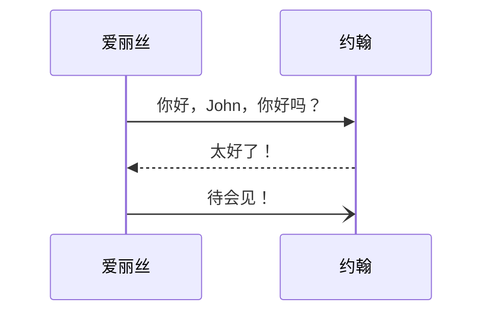
```mermaid
sequenceDiagram 
    爱丽丝->>约翰: 你好，John，你好吗？
    约翰-->>爱丽丝: 太好了！
    爱丽丝-)约翰: 待会见！
```

> 关于节点的注释，由于美人鱼语言的脚本方式，“结束”一词可能会破坏图表。
> 如果不可避免，必须使用圆括号()、引号“”或方括号{}、[]将“end”一词括起来。即: (end), [end], {end}.

## 语法

### 参与者

参与者可以像本页第一个示例中那样隐式定义。参与者或参与者按在图表源文本中的出现顺序呈现。有时，您可能希望以不同于他们在第一条消息中出现的顺序显示参与者。可以通过执行以下操作来指定演员的出现顺序:

```text
sequenceDiagram
    participant Alice
    participant Bob 
    Alice->>Bob: Hi Bob 
    Bob->>Alice: Hi Alice
```

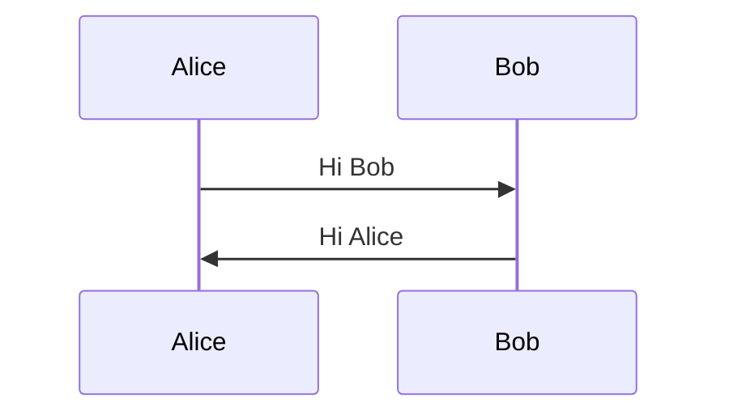
```mermaid
sequenceDiagram
    participant Alice
    participant Bob 
    Alice->>Bob: Hi Bob 
    Bob->>Alice: Hi Alice
```

### 参与者

如果您特别想使用演员符号而不是带有文本的矩形，您可以使用以下演员语句来实现。

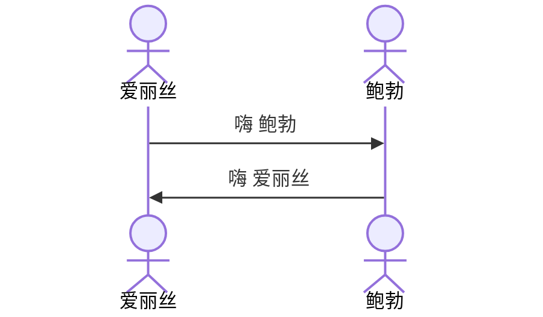
```mermaid
sequenceDiagram
    actor 爱丽丝
    actor 鲍勃
    爱丽丝->>鲍勃: 嗨 鲍勃
    鲍勃->>爱丽丝: 嗨 爱丽丝
```


```mermaid
sequenceDiagram
    actor 爱丽丝
    actor 鲍勃
    爱丽丝->>鲍勃: 嗨 鲍勃
    鲍勃->>爱丽丝: 嗨 爱丽丝
```

### 别名

参与者(`actor`) 可以有一个方便的标识符和一个描述性标签。

```text
sequenceDiagram
    actor A as 爱丽丝
    actor J as 约翰
    A->>J: 你好，约翰，你好吗？
    J->>A: 太好了！
```

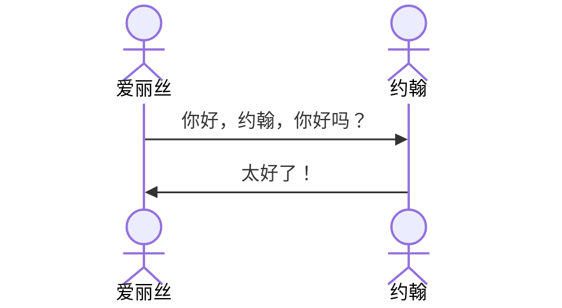
```mermaid
sequenceDiagram
    actor A as 爱丽丝
    actor J as 约翰
    A->>J: 你好，约翰，你好吗？
    J->>A: 太好了！
```

## 消息

消息可以显示两个实线或虚线。

```text
[Actor][Arrow][Actor]:消息文本
```

目前支持六种类型的箭头:

| 类型  | 说明                           |
| ----- | ------------------------------ |
| ->    | 无箭头实线​​                   |
| - ->  | 无箭头的虚线                   |
| ->>   | 带箭头的实线                   |
| - ->> | 带箭头的虚线                   |
| -x    | 实线末尾带十字                 |
| - -x  | 末端带有十字的虚线。           |
| -)    | 实线末尾有一个开放箭头（异步） |
| - -)  | 末尾带有开放箭头的虚线（异步） |

## 激活

可以激活和停用演员。`(de)activate` 可以是专门的声明:

```text
sequenceDiagram
    爱丽丝->>约翰: 你好，约翰，你好吗？
    activate 约翰
    约翰-->>爱丽丝: 太好了！
    deactivate 约翰
```

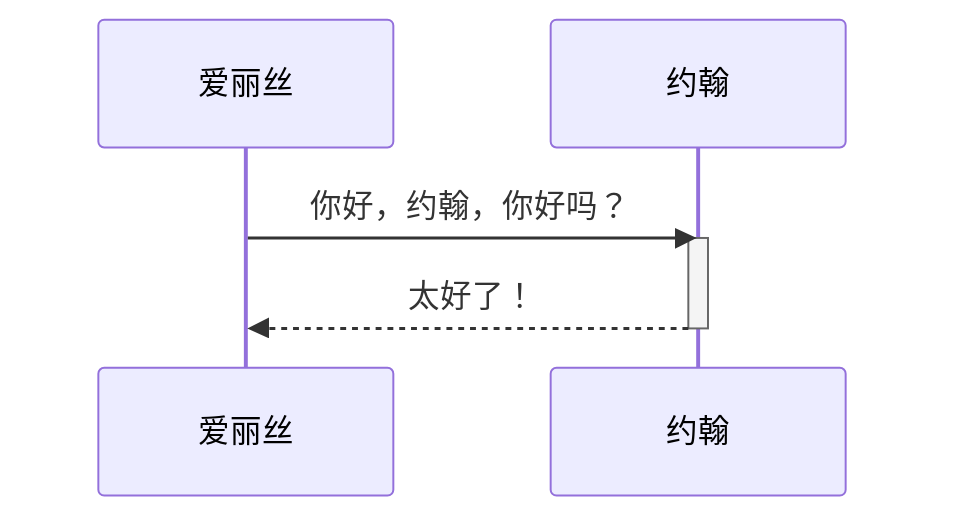
```mermaid
sequenceDiagram
    爱丽丝->>约翰: 你好，约翰，你好吗？
    activate 约翰
    约翰-->>爱丽丝: 太好了！
    deactivate 约翰
```

还有一个快捷符号，通过在消息箭头后附加 `+`/`-` 后缀:

```text
sequenceDiagram 
    爱丽丝->>+约翰: 你好，John，你好吗？
    约翰-->>-爱丽丝: 太好了！
```

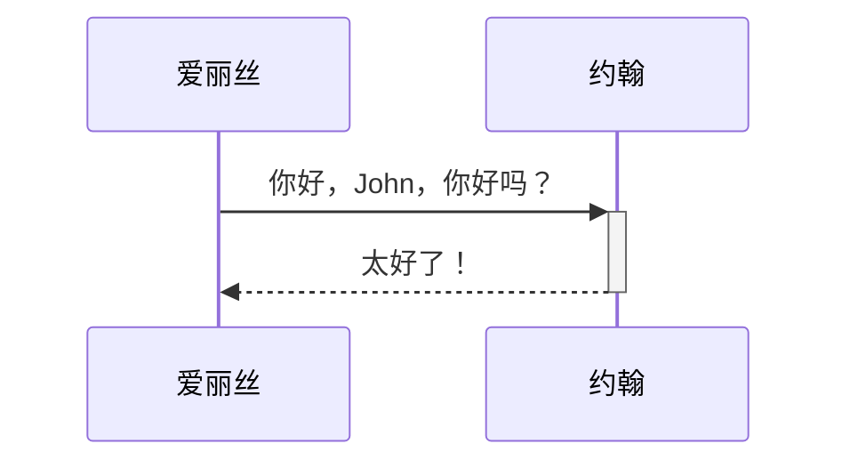
```mermaid
sequenceDiagram 
    爱丽丝->>+约翰: 你好，John，你好吗？
    约翰-->>-爱丽丝: 太好了！
```

激活可以为同一个演员叠加:

```text
sequenceDiagram
    爱丽丝->>+约翰: 你好，John，你好吗？
    爱丽丝->>+约翰: 约翰，你能听到我说话吗？
    约翰-->>-爱丽丝: 嗨爱丽丝，我能听到你的声音！
    约翰-->>-爱丽丝: 我感觉很棒！
```

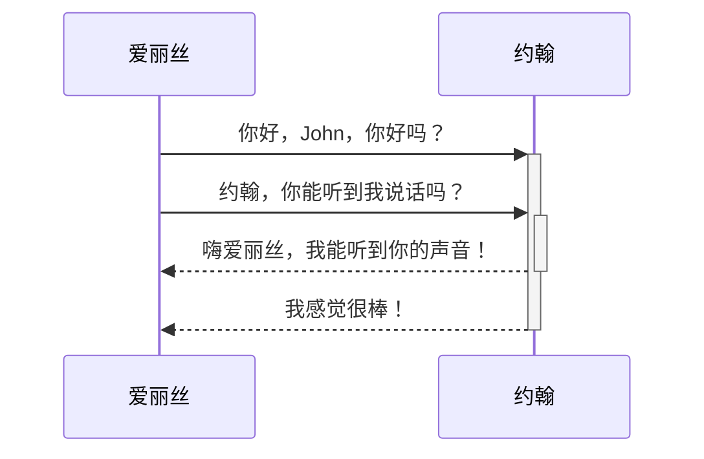
```mermaid
sequenceDiagram
    爱丽丝->>+约翰: 你好，John，你好吗？
    爱丽丝->>+约翰: 约翰，你能听到我说话吗？
    约翰-->>-爱丽丝: 嗨爱丽丝，我能听到你的声音！
    约翰-->>-爱丽丝: 我感觉很棒！
```

## 注释

可以向序列图中添加注释。 通过Note符号格式定义：**Note [ right of | left of | over ] [Actor]: Text**

请看下面的例子:

```text
sequenceDiagram
    participant 约翰 
    Note right of 约翰: 笔记中的文字
```

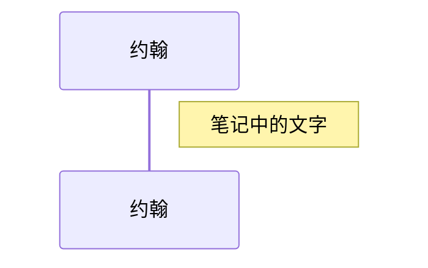
```mermaid
sequenceDiagram
    participant 约翰 
    Note right of 约翰: 笔记中的文字
```

也可以创建跨越两个参与者的笔记:

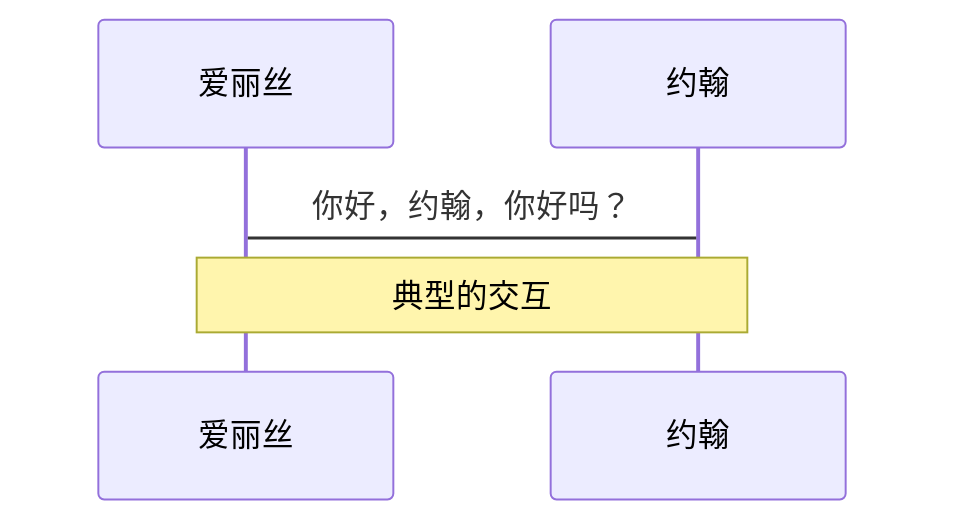
```mermaid
sequenceDiagram 
    爱丽丝->约翰: 你好，约翰，你好吗？
    Note over 爱丽丝,约翰: 典型的交互
```

## 循环

可以在序列图中表达循环。这是通过符号 `loop ... end`

```text
loop Loop text 
... statements ... 
end 
```

参见下面的例子:

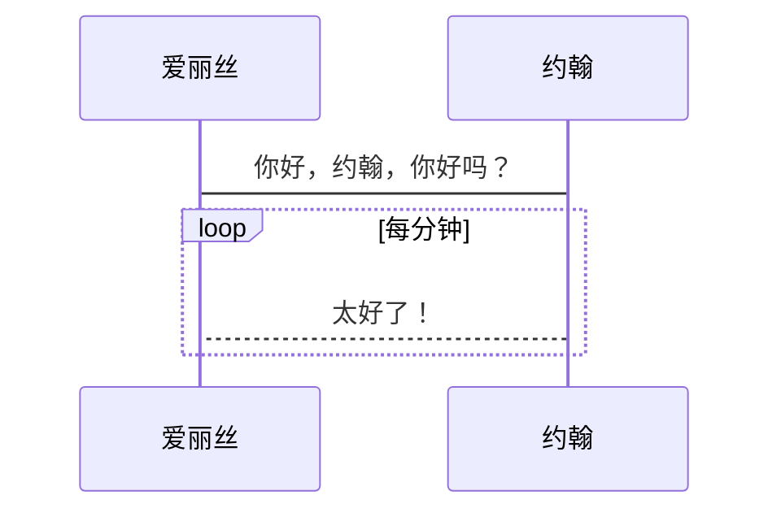
```mermaid
sequenceDiagram 
    爱丽丝->约翰: 你好，约翰，你好吗？
    loop 每分钟
        约翰-->爱丽丝: 太好了！
    end 
```

## 分支

可以在序列图中表达替代路径。这是通过符号 `alt ... else ... end`

```text
alt 描述文本
... 语句 ... 
else 
... 语句 ... 
end 
```

或者如果有可选的序列（如果没有 else）。

```text
opt 描述文本
...语句...
end
```

请参见下面的示例:

```text
sequenceDiagram 
    爱丽丝->>鲍勃: 你好，Bob，你好吗？
    alt 生病
        鲍勃->>爱丽丝: 不太好:(
    else 很好
        鲍勃->>爱丽丝: 精神饱满清新的感觉
    end
    opt 额外的响应
        鲍勃->>爱丽丝: 谢谢关心，谢谢
    end
```

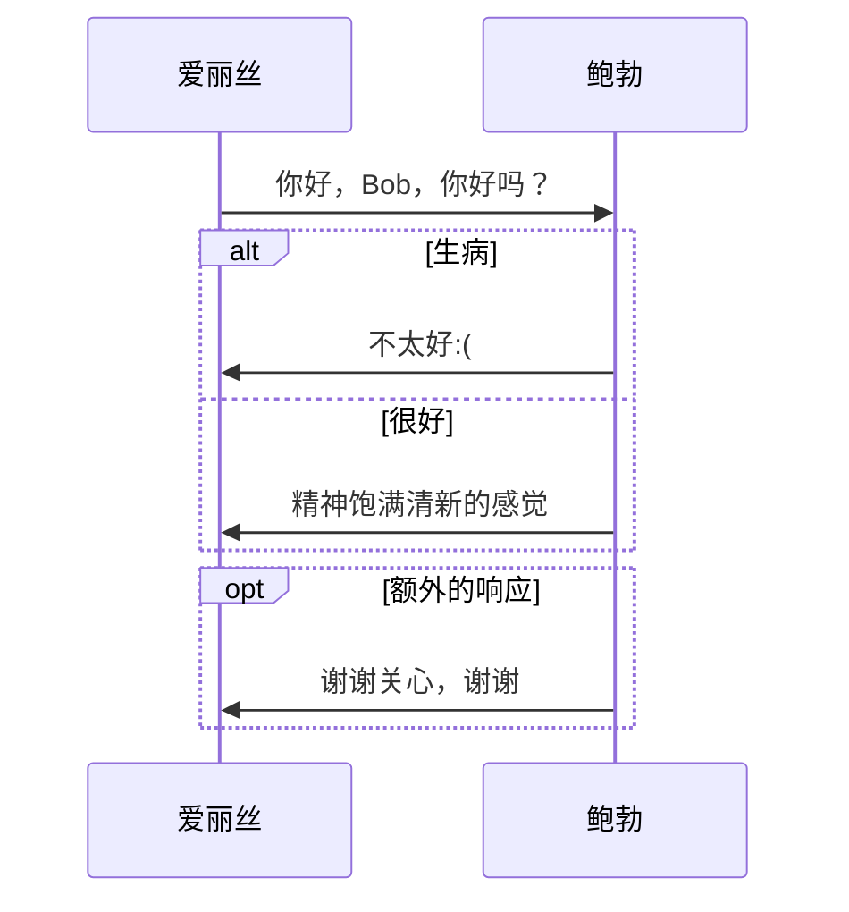
```mermaid
sequenceDiagram 
    爱丽丝->>鲍勃: 你好，Bob，你好吗？
    alt 生病
        鲍勃->>爱丽丝: 不太好:(
    else 很好
        鲍勃->>爱丽丝: 精神饱满清新的感觉
    end
    opt 额外的响应
        鲍勃->>爱丽丝: 谢谢关心，谢谢
    end
```

## 并行

可以显示并行发生的操作。

这是由符号进行 `par ... and ... end`

```text
par [操作1] 
... ...语句
and [操作2] 
... ...语句
and [动作N] 
... ...语句
end
```

见下面的例子:

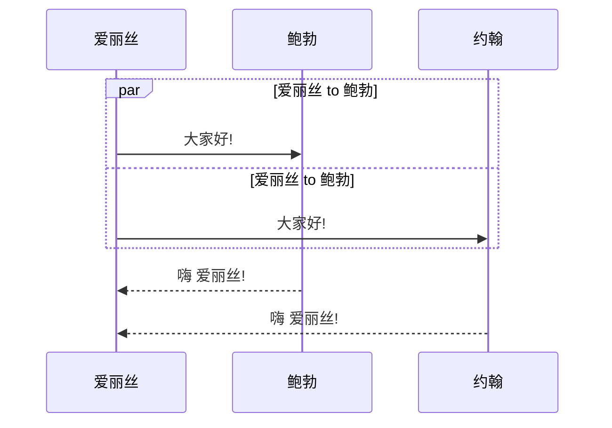
```mermaid
sequenceDiagram 
    par 爱丽丝 to 鲍勃
        爱丽丝->>鲍勃: 大家好!
    and 爱丽丝 to 鲍勃
        爱丽丝->>约翰: 大家好!
    end
    鲍勃-->>爱丽丝: 嗨 爱丽丝!
    约翰-->>爱丽丝: 嗨 爱丽丝!
```

也可以嵌套并行块。

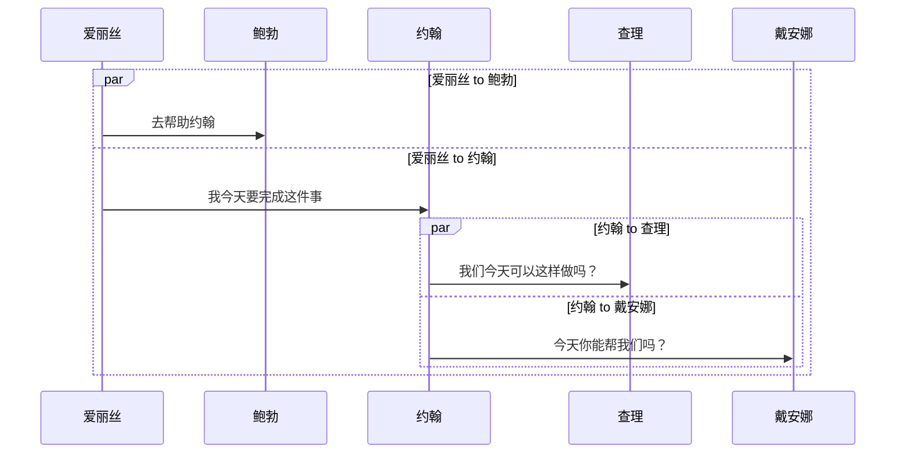
```mermaid
sequenceDiagram
    par 爱丽丝 to 鲍勃
        爱丽丝->>鲍勃: 去帮助约翰
    and 爱丽丝 to 约翰
        爱丽丝->>约翰: 我今天要完成这件事
        par 约翰 to 查理
            约翰->>查理: 我们今天可以这样做吗？
        and 约翰 to 戴安娜
            约翰->>戴安娜: 今天你能帮我们吗？
        end
    end
```

## 背景突出显示

可以通过提供彩色背景矩形突出显示流。这是通过符号完成的

颜色是使用 rgb 和 rgba 语法定义的。

```text
rect rgb(0, 255, 0) 
... content ... 
end 
```

```text
rect rgba(0, 0, 255, .1) 
... content ...
end
```

参见下面的例子:

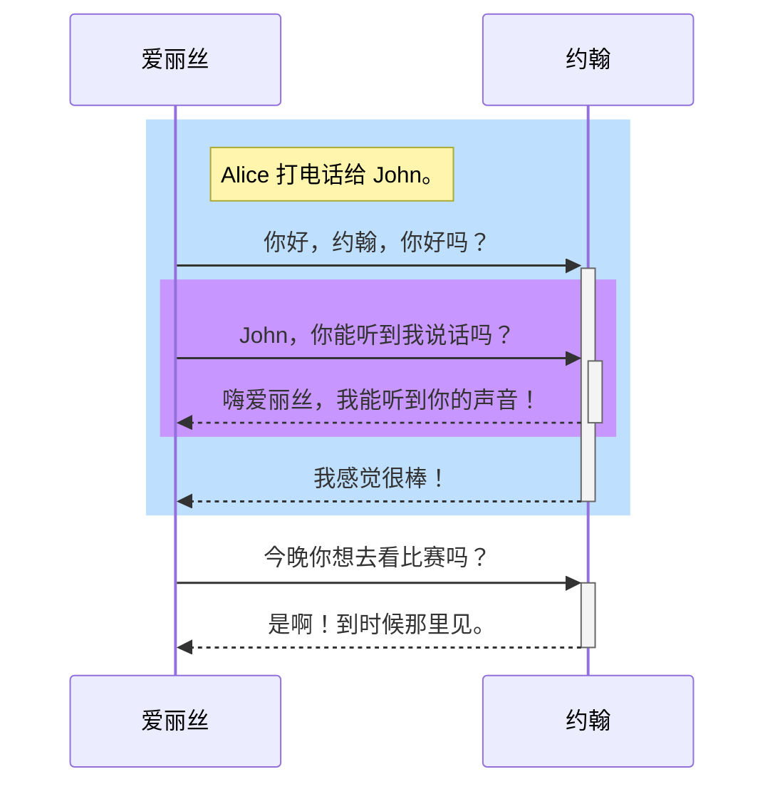
```mermaid
sequenceDiagram
    participant 爱丽丝
    participant 约翰

    rect rgb(191, 223, 255)
    note right of 爱丽丝: Alice 打电话给 John。
    爱丽丝->>+约翰: 你好，约翰，你好吗？
    rect rgb(200, 150, 255)
    爱丽丝->>+约翰: John，你能听到我说话吗？
    约翰-->>-爱丽丝: 嗨爱丽丝，我能听到你的声音！
    end
    约翰-->>-爱丽丝: 我感觉很棒！
    end
    爱丽丝 ->>+ 约翰: 今晚你想去看比赛吗？
    约翰 -->>- 爱丽丝: 是啊！到时候那里见。

```

## 注释

可以在序列图中输入注释，解析器将忽略这些注释。注释需要在自己的行上，并且必须以“%%”（双百分号）开头。下一个换行符的注释开始之后的任何文本都将被视为注释，包括任何图表语法

```mmd
sequenceDiagram 
    Alice->>John: Hello John, how are you?
    %% 这是一个注释
    John-->>Alice: Great!
```

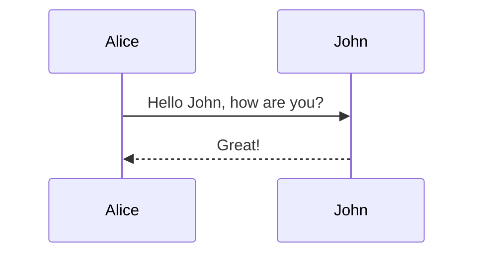
```mermaid
sequenceDiagram 
    Alice->>John: Hello John, how are you?
    %% 这是一个注释
    John-->>Alice: Great!
```

## 转义字符的实体代码

可以使用此处举例说明的语法来转义字符。

```text
sequenceDiagram
    A->>B: 我 #9829; 你！
    B->>A: 我 #9829; 你 #infin; 多倍！
```

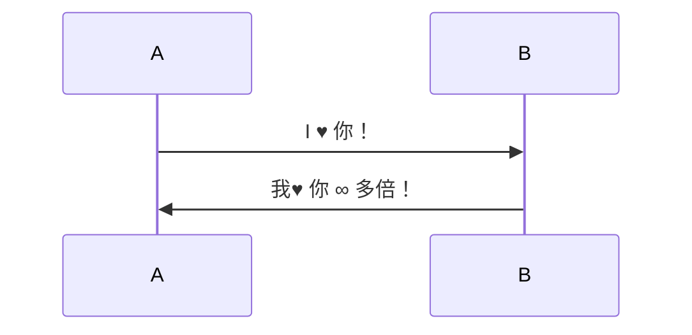
```mermaid
sequenceDiagram
    A->>B: I #9829; 你！
    B->>A: 我#9829; 你 #infin; 多倍！
```

给出的数字以 10 为基数，因此 `#` 可以编码为 `#35;`。还支持使用 HTML 字符名称。

因为可以使用分号代替换行符来定义标记，所以您需要使用`#59;` 在消息文本中包含分号。

## 序列号

可以在序列图中的每个箭头上附加一个序列号。这个可以在网站添加Mermaid时配置如下:

```html
    <script> 
      mermaid.initialize({ 
        sequence: { showSequenceNumbers: true }, 
      }); 
    </script> 
```

也可以通过图代码开启，如图:

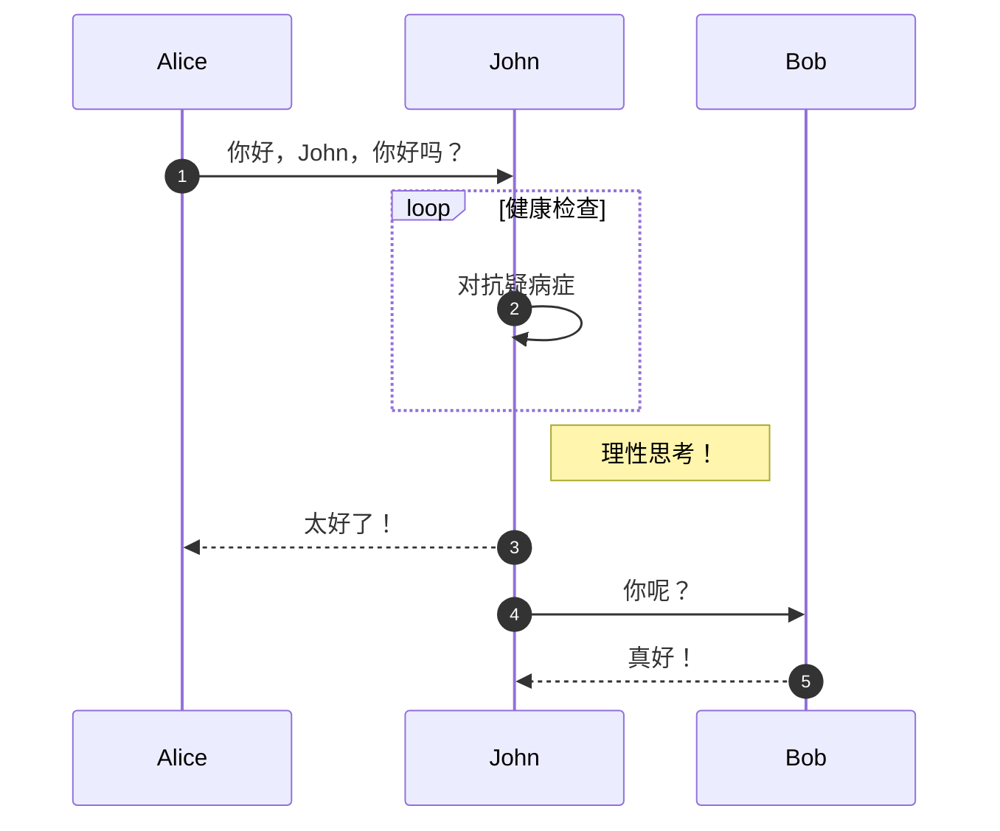
```mermaid
sequenceDiagram
    autonumber
    Alice->>John: 你好，John，你好吗？
    loop 健康检查
        John->>John: 对抗疑病症
    end
    Note right of John: 理性思考！
    John-->>Alice: 太好了！
    John->>Bob: 你呢？
    Bob-->>John: 真好！
```

## 参与者菜单

演员可以有弹出菜单，其中包含指向外部页面的个性化链接。例如，如果参与者代表 Web 服务，则有用的链接可能包括指向服务运行状况仪表板的链接、包含服务代码的存储库或描述服务的 wiki 页面。

这可以通过添加一个或多个链接行来配置，格式为:

```text
link <actor>: <link-label> @ <link-url> 
```

```text
sequenceDiagram
    participant Alice
    participant John
    link Alice: 概览 @ https://dashboard.contoso.com/alice
    link Alice: Wiki @ https://wiki.contoso.com/alice
    link John: 概览 @ https://dashboard.contoso.com/john
    link John: Wiki @ https://wiki.contoso.com/john
    Alice->>John: 你好，约翰， 你好吗？
    John-->>Alice: 太好了！
    Alice-)John: 待会见！
```

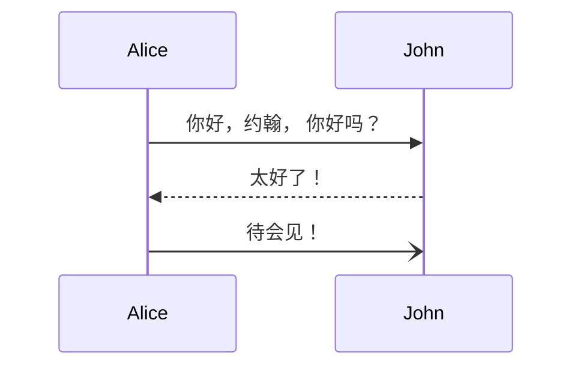
```mermaid
sequenceDiagram
    participant Alice
    participant John
    link Alice: 概览 @ https://dashboard.contoso.com/alice
    link Alice: Wiki @ https://wiki.contoso.com/alice
    link John: 概览 @ https://dashboard.contoso.com/john
    link John: Wiki @ https://wiki.contoso.com/john
    Alice->>John: 你好，约翰， 你好吗？
    John-->>Alice: 太好了！
    Alice-)John: 待会见！
```

### 高级菜单语法

有一种依赖于 JSON 格式的高级语法。如果您对 JSON 格式感到满意，那么这也存在。

这可以通过添加以下格式的链接行进行配置:

```text
links <actor>: <json-formatted link-name link-url pairs>
```

示例如下:

```text
sequenceDiagram
    participant Alice
    participant John
    links Alice: {"“仪表板”": "https://dashboard.contoso.com/alice", "维基": "https://wiki.contoso.com/alice"}
    links John: {"“仪表板”": "https://dashboard.contoso.com/john", "维基": "https://wiki.contoso.com/john"}
    Alice->>John: 你好，John，你好吗？
    John-->>Alice: 太好了！
    Alice-)John: 待会见！
```

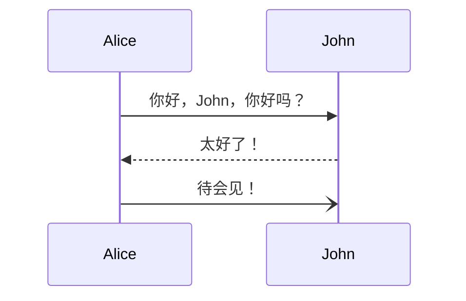
```mermaid
sequenceDiagram
    participant Alice
    participant John
    links Alice: {"仪表板": "https://dashboard.contoso.com/alice", "维基": "https://wiki.contoso.com/alice"}
    links John: {"仪表板": "https://dashboard.contoso.com/john", "维基": "https://wiki.contoso.com/john"}
    Alice->>John: 你好，John，你好吗？
    John-->>Alice: 太好了！
    Alice-)John: 待会见！
```

## 样式

序列图的样式是通过定义许多 css 类来完成的。在渲染过程中，这些类是从位于 `src/themes/sequence.scss` 的文件中提取的

### 可以使用的类

| 类           | 描述                       |
| ------------ | -------------------------- |
| actor        | 角色框图顶部的样式。       |
| text.actor   | 角色框图顶部的文本样式。   |
| actor-line   | 参与者的垂直线             |
| messageLine0 | 实心消息行的样式。         |
| messageLine1 | 虚线消息行的样式。         |
| messageText  | 定义消息箭头上文本的样式。 |
| labelBox     | 将样式标签定义为循环左侧。 |
| labelText    | 循环标签中文本的样式。     |
| loopText     | 循环框中文本的样式。       |
| loopLine     | 定义循环框中线条的样式。   |
| note         | 笔记框的样式。             |
| noteText     | 注释框中文本的样式。       |

### 示例样式表

```css
body {
    background: white;
}

.actor {
    stroke: #ccccff;
    fill: #ececff;
}
text.actor {
    fill: black;
    stroke: none;
    font-family: Helvetica;
}

.actor-line {
    stroke: grey;
}

.messageLine0 {
    stroke-width: 1.5;
    stroke-dasharray: '2 2';
    marker-end: 'url(#arrowhead)';
    stroke: black;
}

.messageLine1 {
    stroke-width: 1.5;
    stroke-dasharray: '2 2';
    stroke: black;
}

#arrowhead {
    fill: black;
}

.messageText {
    fill: black;
    stroke: none;
    font-family: 'trebuchet ms', verdana, arial;
    font-size: 14px;
}

.labelBox {
    stroke: #ccccff;
    fill: #ececff;
}

.labelText {
    fill: black;
    stroke: none;
    font-family: 'trebuchet ms', verdana, arial;
}

.loopText {
    fill: black;
    stroke: none;
    font-family: 'trebuchet ms', verdana, arial;
}

.loopLine {
    stroke-width: 2;
    stroke-dasharray: '2 2';
    marker-end: 'url(#arrowhead)';
    stroke: #ccccff;
}

.note {
    stroke: #decc93;
    fill: #fff5ad;
}

.noteText {
    fill: black;
    stroke: none;
    font-family: 'trebuchet ms', verdana, arial;
    font-size: 14px;
}
```

## 配置

是否可以调整渲染时序图的边距。

这是通过定义 `mermaid.sequenceConfig` 或通过 CLI 使用带有配置的 json 文件来完成的。[mermaidCLI][mermaidCLI] 页面中描述了如何使用 CLI。`mermaid.sequenceConfig` 可以设置为带有配置参数或相应对象的 JSON 字符串。

[mermaidCLI]: https://github.com/mermaid-js/mermaid-cli "mermaidCLI"

```javascript
mermaid.sequenceConfig = { 
    diagramMarginX: 50, 
    diagramMarginY: 10, 
    boxTextMargin: 5, 
    noteMargin: 10, 
    messageMargin: 35, 
    mirrorActors: true
}; 
```

### 可能的配置参数

| Parameter         | Description                                                                                    | Default value                  |
| ----------------- | ---------------------------------------------------------------------------------------------- | ------------------------------ |
| mirrorActors      | 打开/关闭图表下方和上方的Actor的渲染                                                            | false                          |
| bottomMarginAdj   | 调整图表结束的距离。 带有 css 的宽边框样式可能会产生不需要的剪裁，这就是此配置参数存在的原因。 | 1                              |
| actorFontSize     | 设置Actor描述的字体大小                                                                         | 14                             |
| actorFontFamily   | 设置Actor描述的字体家族                                                                         | "Open-Sans", "sans-serif"      |
| actorFontWeight   | 设置Actor描述的字体粗细                                                                         | "Open-Sans", "sans-serif"      |
| noteFontSize      | 设置Actor附加注释的字体大小                                                                     | 14                             |
| noteFontFamily    | 设置Actor附加注释的字体家族                                                                     | "trebuchet ms", verdana, arial |
| noteFontWeight    | 设置Actor附加注释的字体粗细                                                                     | "trebuchet ms", verdana, arial |
| noteAlign         | 设置Actor附加注释中文本的文本对齐方式                                                           | center                         |
| messageFontSize   | 设置 actor<->actor 消息的字体大小                                                              | 16                             |
| messageFontFamily | 设置actor<->actor 消息的字体家族                                                               | "trebuchet ms", verdana, arial |
| messageFontWeight | 设置 actor<->actor 消息的字体粗细                                                              | "trebuchet ms", verdana, arial |
