## Flowcharts - 基本语法

原文: <https://github.com/mermaid-js/mermaid/blob/develop/docs/flowchart.md>

所有流程图都由`节点`、`几何形状`和`边`、`箭头`或`线条`组成。 Mermaid代码定义了这些`节点`和`边`的生成和交互方式。

它还可以容纳不同的箭头类型、多向箭头以及与子图的链接。

> **重要说明**：请勿将“end”一词输入为流程图节点。将所有或任何一个字母大写以防止流程图中断，即“End”或“END”。或者您可以应用此[解决方法](https://github.com/mermaid-js/mermaid/issues/1444#issuecomment-639528897).

## 节点

### 一个节点（默认）

```text
flowchart LR
    id
```

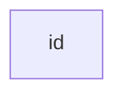

> **注意** id 是框中显示的内容。

### 节点文本

也可以在框中设置与 id 不同的文本。 如果多次这样做，它将是为将使用的节点找到的最后一个文本。 此外，如果稍后为节点定义边，则可以省略文本定义。 渲染框时将使用先前定义的那个。

```text
flowchart LR
    id1[这是框中的文字]
```

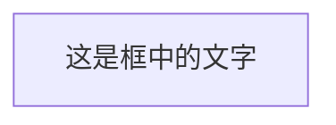

## 绘制方向

该语句声明了流程图的方向。

这声明流程图是从上到下定向的（`TD` 或 `TB`）。

```text
flowchart TD
    Start --> Stop
```

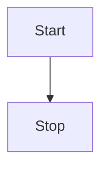

这声明流程图从左到右（`LR`）。

```text
flowchart LR
    Start --> Stop
```

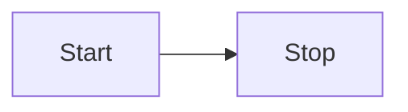

## 流程图方向

可能的流程图方向是：

* TB - 从上到下
* TD - 自上而下/与自上而下相同
* BT - 从下到上
* RL - 从右到左
* LR - 从左到右

## 节点形状

### 一个带有圆边的节点

```text
flowchart LR
    id1(这是框中的文字)
```


### 一个体育场形状的节点

```text
flowchart LR
    id1([这是框中的文字])
```


### 一个子程序形状的节点

```text
flowchart LR
    id1[[这是框中的文字]]
```

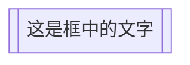

### 一个圆柱形状的节点

```text
flowchart LR
    id1[(数据库)]
```

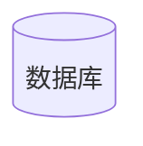

### 一个圆形的节点

```text
flowchart LR
    id1((这是圈内的文字))
```

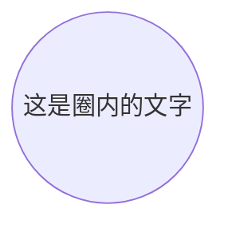

### 一个不对称形状的节点

```text
flowchart LR
    id1>这是框中的文字]
```

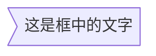

目前只有上面的形状是可能的，而不是它的镜像。*这可能会随着未来的版本而改变。*

### 一个节点（菱形）

```text
flowchart LR
    id1{这是框中的文字}
```

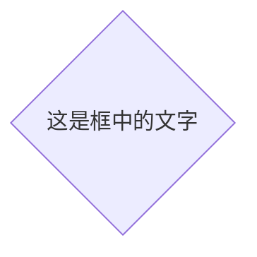

### 一个六边形节点

```text
flowchart LR
    id1{{这是框中的文字}}
```

<!-- 用 &#123; 转义 { , 用 &#125; 转义 }  -->
```mermaid
flowchart LR
    id1&#123;&#123;这是框中的文字&#125;&#125;
```

### 平行四边形

```text
flowchart TD
    id1[/这是框中的文字/]
```

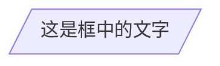

### 平行四边形alt

```text
flowchart TD
    id1[\这是框中的文字\]
```

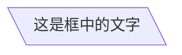

### 梯形

```text
flowchart TD
    A[/Christmas\]
```

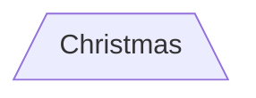

### 梯形alt

```text
flowchart TD
    B[\Go shopping/]
```

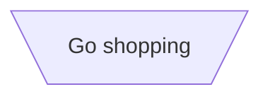

## 连接节点

节点可以通过链接/边连接。可以有不同类型的链接或将文本字符串附加到链接。

### 箭头连接

```text
flowchart LR
    A-->B
```

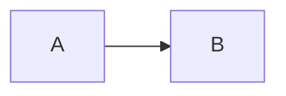

### 打开连接

```text
flowchart LR
    A --- B
```

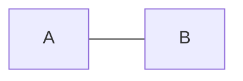

### 连接上的文字

```text
flowchart LR
    A-- 这是文本! ---B
```

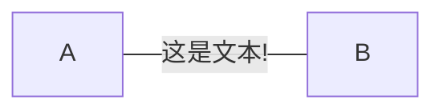

或

```text
flowchart LR
    A---|这是文本|B
```

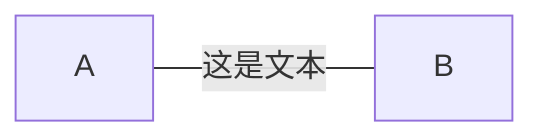

### 带有箭头和文本的连接

```text
flowchart LR
    A-->|text|B
```

```mermaid
flowchart LR
    A-->|text|B
```

或

```text
flowchart LR
    A-- text -->B
```

```mermaid
flowchart LR
    A-- text -->B
```

### 虚线连接

```text
flowchart LR;
   A-.->B;
```

```mermaid
flowchart LR;
   A-.->B;
```

### 虚线连接和文本

```text
flowchart LR
   A-. 文本 .-> B
```

```mermaid
flowchart LR
   A-. 文本 .-> B
```

### 粗连接

```text
flowchart LR
   A ==> B
```

```mermaid
flowchart LR
   A ==> B
```

### 粗连接和文本

```text
flowchart LR
   A == text ==> B
```

```mermaid
flowchart LR
   A == text ==> B
```

### 连续连接

可以在同一行中声明多个链接，如下所示：

```text
flowchart LR
   A -- text --> B -- text2 --> C
```

```mermaid
flowchart LR
   A -- text --> B -- text2 --> C
```

也可以在同一行中声明多个节点链接，如下所示：

```text
flowchart LR
   a --> b & c--> d
```

```mermaid
flowchart LR
   a --> b & c--> d
```

然后，您可以以非常有表现力的方式描述依赖项。像下面的单行：

```text
flowchart TB
    A & B--> C & D
```

```mermaid
flowchart TB
    A & B--> C & D
```

如果您使用基本语法描述同一个图表，它将需要四行。 警告一句，这可能会使流程图更难以降价形式阅读。 我想到了瑞典语“lagom”。 这意味着，不要太多，也不要太少。 这也适用于表达性语法。

```text
flowchart TB
    A --> C
    A --> D
    B --> C
    B --> D
```

```mermaid
flowchart TB
    A --> C
    A --> D
    B --> C
    B --> D
```

### 箭头类型

支持的新箭头类型，如下所示：

```text
flowchart LR
    A --o B
    B --x C
```

```mermaid
flowchart LR
    A --o B
    B --x C
```

### 多向箭头

可以使用多向箭头。

```text
flowchart LR
    A o--o B
    B <--> C
    C x--x D
```

```mermaid
flowchart LR
    A o--o B
    B <--> C
    C x--x D
```

### 链接的最小长度

流程图中的每个节点最终都被分配到渲染图中的一个等级，即根据其链接到的节点，分配到垂直或水平级别（取决于流程图方向）。 默认情况下，链接可以跨越任意数量的等级，但您可以通过在链接定义中添加额外的破折号（--）来要求任何链接比其他链接更长。

在以下示例中，在从节点 _B_ 到节点 _E_ 的链接中添加了两个额外的破折号（--），因此它比常规链接多跨越两个等级：

```text
flowchart TD
    A[开始] --> B{是吗?};
    B -->|是| C[好的];
    C --> D[重新思考];
    D --> B;
    B ---->|不| E[结束];
```

```mermaid
flowchart TD
    A[开始] --> B{是吗?};
    B -->|是| C[好的];
    C --> D[重新思考];
    D --> B;
    B ---->|不| E[结束];
```

> **注意:** 链接可能仍然比渲染引擎请求的等级数更长以适应其他请求。

当连接标签写在连接中间时，必须在连接的右侧添加额外的破折号。 以下示例等效于前一个示例：

```text
flowchart TD
    A[Start] --> B{Is it?};
    B -- Yes --> C[OK];
    C --> D[Rethink];
    D --> B;
    B -- No ----> E[End];
```

```mermaid
flowchart TD
    A[Start] --> B{Is it?};
    B -- Yes --> C[OK];
    C --> D[Rethink];
    D --> B;
    B -- No ----> E[End];
```

对于虚线或粗链接，要添加的字符为等号或点，总结如下表：

| 长度       |   1    |    2    |    3     |
| ---------- | :----: | :-----: | :------: |
| 正常       | `---`  | `----`  | `-----`  |
| 正常带箭头 | `-->`  | `--->`  | `---->`  |
| 粗线       | `===`  | `====`  | `======` |
| 粗线带箭头 | `==>`  | `===>`  | `====>`  |
| 虚线       | `-.-`  | `-..-`  | `-...-`  |
| 虚线带箭头 | `-.->` | `-..->` | `-...->` |

## 破坏语法的特殊字符

可以将文本放在引号内以呈现更麻烦的字符。如下例所示：

```text
flowchart LR
    id1["This is the (text) in the box"]
```

```mermaid
flowchart LR
    id1["This is the (text) in the box"]
```

### 实体代码转义字符

可以使用此处举例说明的语法对字符进行转义。

```text
    flowchart LR
        A["A double quote:#quot;"] -->B["A dec char:#9829;"]
```

```mermaid
    flowchart LR
        A["A double quote:#quot;"] -->B["A dec char:#9829;"]
```

给出的数字以 10 为基数，因此 `#` 可以编码为 `#35;`。还支持使用 HTML 字符名称。

## 子图

```text
subgraph title
    graph definition
end
```

下面是一个例子:

```text
flowchart TB
    c1-->a2
    subgraph one
    a1-->a2
    end
    subgraph two
    b1-->b2
    end
    subgraph three
    c1-->c2
    end
```

```mermaid
flowchart TB
    c1-->a2
    subgraph one
    a1-->a2
    end
    subgraph two
    b1-->b2
    end
    subgraph three
    c1-->c2
    end
```

 您还可以为子图设置显式 id。

```text
flowchart TB
    c1-->a2
    subgraph ide1 [one]
    a1-->a2
    end
```

```mermaid
flowchart TB
    c1-->a2
    subgraph ide1 [one]
    a1-->a2
    end
```

## 测试版：流程图

使用图类型流程图，还可以设置与子图之间的边，如下面的流程图所示。

```text
flowchart TB
    c1-->a2
    subgraph 一
    a1-->a2
    end
    subgraph 二
    b1-->b2
    end
    subgraph 三
    c1-->c2
    end
    一 --> 二
    三 --> 二
    二 --> c2
```

```mermaid
flowchart TB
    c1-->a2
    subgraph 一
    a1-->a2
    end
    subgraph 二
    b1-->b2
    end
    subgraph 三
    c1-->c2
    end
    一 --> 二
    三 --> 二
    二 --> c2
 ```

## 子图中的方向

使用流程图，可以使用`方向`(direction)语句来设置子图将呈现的方向，如本例所示。

```text
flowchart LR
  subgraph TOP
    direction TB
    subgraph B1
        direction RL
        i1 -->f1
    end
    subgraph B2
        direction BT
        i2 -->f2
    end
  end
  A --> TOP --> B
  B1 --> B2
 ```

```mermaid
flowchart LR
  subgraph TOP
    direction TB
    subgraph B1
        direction RL
        i1 -->f1
    end
    subgraph B2
        direction BT
        i2 -->f2
    end
  end
  A --> TOP --> B
  B1 --> B2
 ```

## 交互

可以将单击事件绑定到节点，单击可以导致 JavaScript 回调或将在新浏览器选项卡中打开的链接。**注意**：使用 `securityLevel='strict'` 时禁用此功能，使用 `securityLevel='loose'` 时启用此功能。

```text
click nodeId callback
click nodeId call callback()
```

* nodeId 是节点的id
* callback 是在显示图表的页面上定义的 javascript 函数的名称，该函数将以 nodeId 作为参数被调用。

下面的工具提示用法示例：

```html
<script>
  var callback = function(){
      alert('A callback was triggered');
  }
</script>
```

<script>
  var callback = function(){
      alert('A callback was triggered');
  }
</script>

工具提示文本用双引号括起来。工具提示的样式由类`.mermaidTooltip` 设置。

```text
flowchart LR;
    A-->B;
    B-->C;
    C-->D;
    click A callback "Tooltip for a callback"
    click B "http://www.github.com" "This is a tooltip for a link"
    click A call callback() "Tooltip for a callback"
    click B href "http://www.github.com" "This is a tooltip for a link"
```

```mermaid
flowchart LR;
    A-->B;
    B-->C;
    C-->D;
    click A callback "Tooltip for a callback"
    click B "http://www.github.com" "This is a tooltip for a link"
    click A call callback() "Tooltip for a callback"
    click B href "http://www.github.com" "This is a tooltip for a link"
```

> **成功** 工具提示功能和链接到 url 的能力从 0.5.2 版开始可用。
> 由于 Docsify 如何处理 JavaScript 回调函数的限制，可以在 [this jsfiddle](https://jsfiddle.net/s37cjoau/3/) 查看上述代码的替代工作演示。

默认情况下，链接在同一浏览器选项卡/窗口中打开。可以通过向点击定义添加链接目标来更改此设置（支持`_self`、`_blank`、`_parent` 和`_top`）：

```text
flowchart LR;
    A-->B;
    B-->C;
    C-->D;
    D-->E;
    click A "http://www.github.com" _blank
    click B "http://www.github.com" "Open this in a new tab" _blank
    click C href "http://www.github.com" _blank
    click D href "http://www.github.com" "Open this in a new tab" _blank
```

```mermaid
flowchart LR;
    A-->B;
    B-->C;
    C-->D;
    D-->E;
    click A "http://www.github.com" _blank
    click B "http://www.github.com" "Open this in a new tab" _blank
    click C href "http://www.github.com" _blank
    click D href "http://www.github.com" "Open this in a new tab" _blank
```

初学者提示，在 html 上下文中使用交互式链接的完整示例：

```html
<body>
  <div class="mermaid">
    flowchart LR;
        A-->B;
        B-->C;
        C-->D;
        click A callback "Tooltip"
        click B "http://www.github.com" "This is a link"
        click C call callback() "Tooltip"
        click D href "http://www.github.com" "This is a link"
  </div>

  <script>
    var callback = function(){
        alert('A callback was triggered');
    }
    var config = {
        startOnLoad:true,
        flowchart:{
            useMaxWidth:true,
            htmlLabels:true,
            curve:'cardinal',
        },
        securityLevel:'loose',
    };

    mermaid.initialize(config);
  </script>
</body>
```

### 注释

可以在流程图中输入注释，解析器将忽略这些注释。注释需要在自己的行上，并且必须以“%%”（双百分号）开头。下一个换行符的注释开始之后的任何文本都将被视为注释，包括任何流程语法

```text
flowchart LR
%% this is a comment A -- text --> B{node}
   A -- text --> B -- text2 --> C
```

```mermaid
flowchart LR
%% this is a comment A -- text --> B{node}
   A -- text --> B -- text2 --> C
```

## 样式和类

### 链接样式

可以对链接进行样式设置。 例如，您可能想要为在流程中倒退的链接设置样式。 由于链接没有与节点相同的 id，因此需要一些其他方式来决定链接应该附加到什么样式。 使用在图中定义链接时的顺序号而不是 id。 在下面的示例中，linkStyle 语句中定义的样式将属于图中的第四个链接：

```text
linkStyle 3 stroke:#ff3,stroke-width:4px,color:red;
```

### 设置节点样式

可以对节点应用特定样式，例如较粗的边框或不同的背景颜色。

```text
flowchart LR
    id1(Start)-->id2(Stop)
    style id1 fill:#f9f,stroke:#333,stroke-width:4px
    style id2 fill:#bbf,stroke:#f66,stroke-width:2px,color:#fff,stroke-dasharray: 5 5
```

```mermaid
flowchart LR
    id1(开始)-->id2(结束)
    style id1 fill:#f9f,stroke:#333,stroke-width:4px
    style id2 fill:#bbf,stroke:#f66,stroke-width:2px,color:#fff,stroke-dasharray: 5 5
```

#### 样式类

比每次都定义样式更方便的是定义一个样式类并将这个类附加到应该具有不同外观的节点上。

类定义类似于以下示例：

```css
    classDef className fill:#f9f,stroke:#333,stroke-width:4px;
```

将类附加到节点的操作如下：

```css
    class nodeId1 className;
```

也可以在一个语句中将一个类附加到节点列表：

```css
    class nodeId1,nodeId2 className;
```

添加类的一种更简短的形式是使用`::::`运算符将类名附加到节点，如下所示：

```text
flowchart LR
    A:::someclass --> B
    classDef someclass fill:#f96;
```

```mermaid
flowchart LR
    A:::someclass --> B
    classDef someclass fill:#f96;
```

### CSS 类

也可以在 css 样式中预定义类，这些类可以从图定义中应用，如下所示：

**示例样式:**

```html
<style>
    .cssClass > rect{
        fill:#FF0000;
        stroke:#FFFF00;
        stroke-width:4px;
    }
</style>
```

**示例定义:**

```mermaid
flowchart LR;
    A-->B[AAA<span>BBB</span>];
    B-->D;
    class A cssClass;
```

### 默认类

如果一个类被命名为 default，它将被分配给所有没有特定类定义的类。

```css
    classDef default fill:#f9f,stroke:#333,stroke-width:4px;
```

## 对 fontawesome 的基本支持

可以从 fontawesome 添加图标。

图标通过语法 `fa:#icon class name#` 访问。

```text
flowchart TD
    B["fa:fa-twitter for peace"]
    B-->C[fa:fa-ban forbidden]
    B-->D(fa:fa-spinner);
    B-->E(A fa:fa-camera-retro perhaps?);
```

```mermaid
flowchart TD
    B["fa:fa-twitter for peace"]
    B-->C[fa:fa-ban forbidden]
    B-->D(fa:fa-spinner);
    B-->E(A fa:fa-camera-retro perhaps?);
```

## 顶点和连接之间有空格且没有分号的图形声明

* 在图形声明中，语句现在也可以不用分号结束。在 0.2.16 版本之后，以分号(;)结束图形语句只是可选的。因此，下面的图形声明与图形的旧声明一起也有效。
* 顶点和链接之间允许有一个空格。但是，顶点与其文本和链接与其文本之间不应有任何空格。图声明的旧语法也可以使用，因此这个新特性是可选的，引入是为了提高可读性。

下面是图边的新声明，它也与图边的旧声明一起有效。

```text
flowchart LR
    A[Hard edge] -->|Link text| B(Round edge)
    B --> C{Decision}
    C -->|One| D[Result one]
    C -->|Two| E[Result two]
```

```mermaid
flowchart LR
    A[方形变] -->|连接文本| B(圆角)
    B --> C{Decision}
    C -->|One| D[结果1]
    C -->|Two| E[结果2]
```

## 配置

是否可以调整渲染流程图的宽度。

这是通过定义 **mermaid.flowchartConfig** 或通过 CLI 使用带有配置的 json 文件来完成的。 mermaidCLI 页面中描述了如何使用 CLI。 `mermaid.flowchartConfig` 可以设置为带有配置参数或相应对象的 JSON 字符串。

```javascript
mermaid.flowchartConfig = {
    width: 100%
}
```
