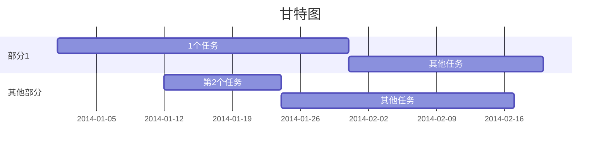
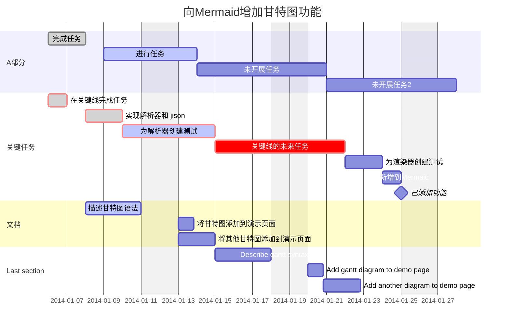
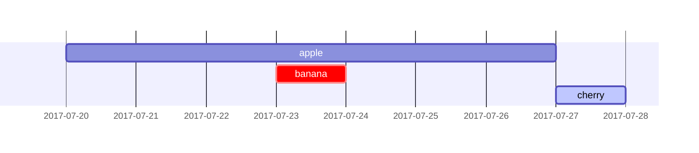
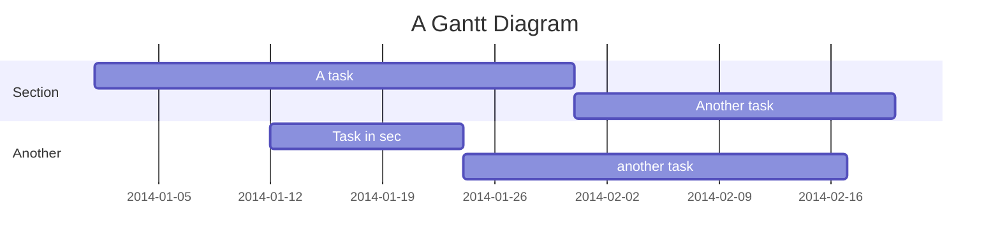

原文: <https://mermaid-js.github.io/mermaid/#/gantt>

## 甘特图

> 甘特图是一种条形图，由 Karol Adamiecki 于 1896 年首次开发，1910 年代由 Henry Gantt 独立开发，用于**说明项目进度和完成任何项目所需的时间**。 甘特图说明项目的终端元素和摘要元素的开始日期和完成日期之间的天数。
>
> A Gantt chart is a type of bar chart, first developed by Karol Adamiecki in 1896, and independently by Henry Gantt in the 1910s, that illustrates a project schedule and the amount of time it would take for any one project to finish. Gantt charts illustrate number of days between the start and finish dates of the terminal elements and summary elements of a project.

### 用户须知

甘特图将每个计划任务记录为一个从左向右延伸的连续条。 x 轴代表时间，y 轴记录不同的任务及其完成的顺序。

Gantt Charts will record each scheduled task as one continuous bar that extends from the left to the right. The x axis represents time and the y records the different tasks and the order in which they are to be completed.

重要的是要记住，当特定于任务的日期、日期或日期集合被“排除”时，甘特图将通过向右扩展相同的天数来适应这些更改，而不是通过在任务内部创建间隙。

It is important to remember that when a date, day, or collection of dates specific to a task are "excluded", the Gantt Chart will accomodate those changes by extending an equal number of days, towards the right, not by creating a gap inside the task.
As shown here 

但是，如果排除的日期在两个设置为连续开始的任务之间，则排除的日期将被图形跳过并留空，并且在排除的日期结束后将开始下一个任务。

However, if the excluded dates are between two tasks that are set to start consecutively, the excluded dates will be skipped graphically and left blank, and the following task will begin after the end of the excluded dates.
As shown here 

甘特图可用于跟踪项目完成前所需的时间，但它也可用于以图形方式表示“非工作日”，只需稍作调整。

A Gantt chart is useful for tracking the amount of time it would take before a project is finished, but it can also be used to graphically represent "non-working days", with a few tweaks.

Mermaid 可以将甘特图呈现为 SVG、PNG 或可以粘贴到文档中的 MarkDown 链接。

Mermaid can render Gantt diagrams as SVG, PNG or a MarkDown link that can be pasted into docs.

```text
gantt
    title 甘特图
    dateFormat  YYYY-MM-DD

    section 部分1
    1个任务           :a1, 2014-01-01, 30d
    其他任务          :after a1  , 20d

    section 其他部分
    第2个任务      :2014-01-12  , 12d
    其他任务      : 24d
```



### 语法

```text
gantt
    dateFormat  YYYY-MM-DD
    title       向Mermaid增加甘特图功能
    excludes    weekends
    %% (`excludes` accepts specific dates in YYYY-MM-DD format, days of the week ("sunday") or "weekends", but not the word "weekdays".)
    %% (`excludes` 接受 YYYY-MM-DD 格式的特定日期、星期几（“sunday”）或“weekends”，但不接受“weekdays”词。)

    section A部分
    完成任务                 :done,    des1, 2014-01-06,2014-01-08
    进行任务                 :active,  des2, 2014-01-09, 3d
    未开展任务               :         des3, after des2, 5d
    未开展任务2              :         des4, after des3, 5d

    section 关键任务
    在关键线完成任务             :crit, done, 2014-01-06,24h
    实现解析器和 jison          :crit, done, after des1, 2d
    为解析器创建测试             :crit, active, 3d
    关键线的未来任务              :crit, 5d
    为渲染器创建测试             :2d
    新增到Mermaid                      :1d
    已添加功能                 :milestone, 2014-01-25, 0d

    section 文档
    描述甘特图语法               :active, a1, after des1, 3d
    将甘特图添加到演示页面        :after a1  , 20h
    将其他甘特图添加到演示页面     :doc1, after a1  , 48h

    section Last section
    Describe gantt syntax               :after doc1, 3d
    Add gantt diagram to demo page      :20h
    Add another diagram to demo page    :48h
```



可以设置由多个空格分隔的依赖项：

It is possible to set multiple dependencies separated by space:

```text
    gantt
        apple :a, 2017-07-20, 1w
        banana :crit, b, 2017-07-23, 1d
        cherry :active, c, after b a, 1d
```



#### 标题

标题是一个可选的字符串，显示在甘特图的顶部，用于描述整个图表。

The `title` is an *optional* string to be displayed at the top of the Gantt chart to describe the chart as a whole.

#### 节语句

您可以将图表分成不同的部分，例如将项目的不同部分（如开发和文档）分开。

You can divide the chart into various sections, for example to separate different parts of a project like development and documentation.

为此，请以 `section` 关键字开始一行并为其命名。 （请注意，与整个图表的[标题](#标题)不同，此名称是必需的。

To do so, start a line with the `section` keyword and give it a name. (Note that unlike with the [title for the entire chart](#title), this name is *required*.

#### 里程碑

您可以向图表添加里程碑。 里程碑与任务不同，因为它们代表一个单一的时刻，并由关键字里程碑标识。 以下是有关如何使用里程碑的示例。 您可能会注意到，里程碑的确切位置由里程碑的初始日期和任务的“持续时间”确定：初始日期+持续时间/2。

You can add milestones to the diagrams. Milestones differ from tasks as they represent a single instant in time and are identified by the keyword `milestone`. Below is an example on how to use milestones. As you may notice, the exact location of the milestone is determined by the initial date for the milestone and the "duration" of the task this way: *initial date*+*duration*/2.

```text
gantt 
dateFormat HH:mm
axisFormat %H:%M
Initial milestone : milestone, m1, 17:49,2min
taska2 : 10min
taska3 : 5min 
Final milestone : milestone, m2, 18:14, 2min
```



```mermaid
gantt 
dateFormat HH:mm
axisFormat %H:%M
Initial milestone : milestone, m1, 17:49,2min
taska2 : 10min
taska3 : 5min 
Final milestone : milestone, m2, 18:14, 2min
```

### 日期设置

`dateFormat` 定义甘特图元素的日期输入格式。 这些日期在呈现的图表输出中的表示方式由 `axisFormat` 定义。

`dateFormat` defines the format of the date **input** of your gantt elements. How these dates are represented in the rendered chart **output** are defined by `axisFormat`.

#### 输入日期格式

The default input date format is `YYYY-MM-DD`. You can define your custom ``dateFormat``.

```text 日期格式
dateFormat YYYY-MM-DD
```

The following formating options are supported:

```text 日期格式详细
Input       Example             Description:
YYYY        2014                4 digit year
YY          14                  2 digit year
Q           1..4                Quarter of year. Sets month to first month in quarter.
M MM        1..12               Month number
MMM MMMM    January..Dec        Month name in locale set by moment.locale()
D DD        1..31               Day of month
Do          1st..31st           Day of month with ordinal
DDD DDDD    1..365              Day of year
X           1410715640.579      Unix timestamp
x           1410715640579       Unix ms timestamp
H HH        0..23               24 hour time
h hh        1..12               12 hour time used with a A.
a A         am pm               Post or ante meridiem
m mm        0..59               Minutes
s ss        0..59               Seconds
S           0..9                Tenths of a second
SS          0..99               Hundreds of a second
SSS         0..999              Thousandths of a second
Z ZZ        +12:00              Offset from UTC as +-HH:mm, +-HHmm, or Z
```

More info in: <http://momentjs.com/docs/#/parsing/string-format/>

#### 输出日期格式

The default output date format is YYYY-MM-DD. You can define your custom ``axisFormat``, like `2020-Q1` for the first quarter of the year 2020.

```text 日期格式
axisFormat  %Y-%m-%d
```

The following formating strings are supported:

```text 日期格式详细
%a - abbreviated weekday name.
%A - full weekday name.
%b - abbreviated month name.
%B - full month name.
%c - date and time, as "%a %b %e %H:%M:%S %Y".
%d - zero-padded day of the month as a decimal number [01,31].
%e - space-padded day of the month as a decimal number [ 1,31]; equivalent to %_d.
%H - hour (24-hour clock) as a decimal number [00,23].
%I - hour (12-hour clock) as a decimal number [01,12].
%j - day of the year as a decimal number [001,366].
%m - month as a decimal number [01,12].
%M - minute as a decimal number [00,59].
%L - milliseconds as a decimal number [000, 999].
%p - either AM or PM.
%S - second as a decimal number [00,61].
%U - week number of the year (Sunday as the first day of the week) as a decimal number [00,53].
%w - weekday as a decimal number [0(Sunday),6].
%W - week number of the year (Monday as the first day of the week) as a decimal number [00,53].
%x - date, as "%m/%d/%Y".
%X - time, as "%H:%M:%S".
%y - year without century as a decimal number [00,99].
%Y - year with century as a decimal number.
%Z - time zone offset, such as "-0700".
%% - a literal "%" character.
```

More info in: <https://github.com/mbostock/d3/wiki/Time-Formatting>

### 注释

Comments can be entered within a gantt chart, which will be ignored by the parser. Comments need to be on their own line and must be prefaced with `%%` (double percent signs). Any text after the start of the comment to the next newline will be treated as a comment, including any diagram syntax

```text
gantt
    title A Gantt Diagram
    %% this is a comment
    dateFormat  YYYY-MM-DD
    section Section
    A task           :a1, 2014-01-01, 30d
    Another task     :after a1  , 20d
    section Another
    Task in sec      :2014-01-12  , 12d
    another task      : 24d

```



### 样式

Styling of the a gantt diagram is done by defining a number of css classes. During rendering, these classes are extracted from the file located at src/themes/gantt.scss

#### 样式类

Class | Description
---                   | ---
grid.tick             | Styling for the Grid Lines
grid.path             | Styling for the Grid's borders
.taskText             | Task Text Styling
.taskTextOutsideRight | Styling for Task Text that exceeds the activity bar towards the right.
.taskTextOutsideLeft  | Styling for Task Text that exceeds the activity bar, towards the left.
todayMarker           | Toggle and Styling for the "Today Marker"

#### 示例样式

```css
.grid .tick {
    stroke: lightgrey;
    opacity: 0.3;
    shape-rendering: crispEdges;
}
.grid path {
    stroke-width: 0;
}

#tag {
    color: white;
    background: #FA283D;
    width: 150px;
    position: absolute;
    display: none;
    padding:3px 6px;
    margin-left: -80px;
    font-size: 11px;
}

#tag:before {
    border: solid transparent;
    content: ' ';
    height: 0;
    left: 50%;
    margin-left: -5px;
    position: absolute;
    width: 0;
    border-width: 10px;
    border-bottom-color: #FA283D;
    top: -20px;
}
.taskText {
    fill:white;
    text-anchor:middle;
}
.taskTextOutsideRight {
    fill:black;
    text-anchor:start;
}
.taskTextOutsideLeft {
    fill:black;
    text-anchor:end;
}
```

### Today 标记

You can style or hide the marker for the current date. To style it, add a value for the `todayMarker` key.

```text
todayMarker stroke-width:5px,stroke:#0f0,opacity:0.5
```

To hide the marker, set `todayMarker` to `off`.

```text
todayMarker off
```

### 配置

It is possible to adjust the margins for rendering the gantt diagram.

This is done by defining the `ganttConfig` part of the configuration object.
How to use the CLI is described in the [mermaidCLI](mermaidCLI.html) page.

mermaid.ganttConfig can be set to a JSON string with config parameters or the corresponding object.

```javascript
mermaid.ganttConfig = {
    titleTopMargin:25,
    barHeight:20,
    barGap:4,
    topPadding:75,
    sidePadding:75
}
```

#### 配置参数

Param | Description | Default value
--- | --- | ---
mirrorActor|Turns on/off the rendering of actors below the diagram as well as above it|false
bottomMarginAdj|Adjusts how far down the graph ended. Wide borders styles with css could generate unwanted clipping which is why this config param exists.|1

### 交互

It is possible to bind a click event to a task. The click can lead to either a javascript callback or to a link which will be opened in the current browser tab. **Note**: This functionality is disabled when using `securityLevel='strict'` and enabled when using `securityLevel='loose'`.

```text
click taskId call callback(arguments)
click taskId href URL
```

* taskId is the id of the task
* callback is the name of a javascript function defined on the page displaying the graph, the function will be called with the taskId as the parameter if no other arguments are specified.

Beginners tip, a full example using interactive links in an html context:
```html
<body>
  <div class="mermaid">
    gantt
      dateFormat  YYYY-MM-DD

      section Clickable
      Visit mermaidjs           :active, cl1, 2014-01-07, 3d
      Print arguments         :cl2, after cl1, 3d
      Print task              :cl3, after cl2, 3d

      click cl1 href "https://mermaidjs.github.io/"
      click cl2 call printArguments("test1", "test2", test3)
      click cl3 call printTask()
  </div>

  <script>
    var printArguments = function(arg1, arg2, arg3) {
      alert('printArguments called with arguments: ' + arg1 + ', ' + arg2 + ', ' + arg3);
    }
    var printTask = function(taskId) {
      alert('taskId: ' + taskId);
    }
    var config = {
      startOnLoad:true,
      securityLevel:'loose',
    };
    mermaid.initialize(config);
  </script>
</body>
```
