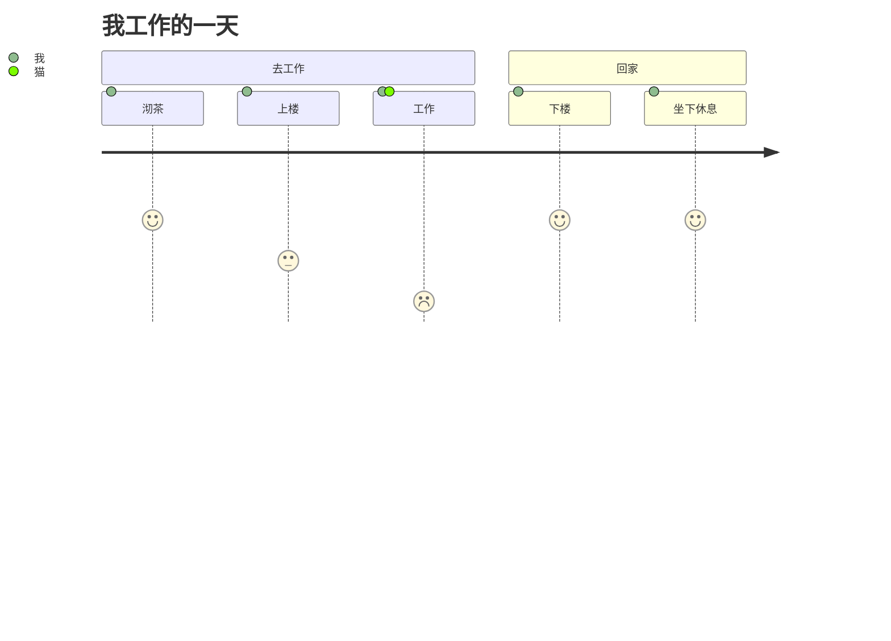

## User Journey Diagram

> 用户旅程图高度详细地描述了不同用户在系统、应用程序或网站中完成特定任务所采取的具体步骤。 此技术显示当前（原样）用户工作流程，并揭示未来工作流程的改进领域。 （维基百科）
>
> User journeys describe at a high level of detail exactly what steps different users take to complete a specific task within a system, application or website. This technique shows the current (as-is) user workflow, and reveals areas of improvement for the to-be workflow. (Wikipedia)

Mermaid can render user journey diagrams:

```text
journey
    title 我工作的一天
    section 去工作
      沏茶: 5: 我
      上楼: 3: 我
      工作: 1: 我, 猫
    section 回家
      下楼: 5: 我
      坐下休息: 5: 我
```



Each user journey is split into sections, these describe the part of the task
the user is trying to complete.

Tasks syntax is `Task name: <score>: <comma separated list of actors>`
