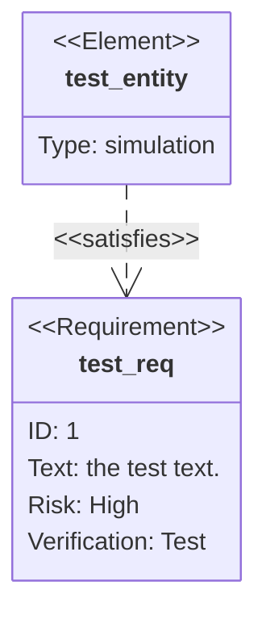
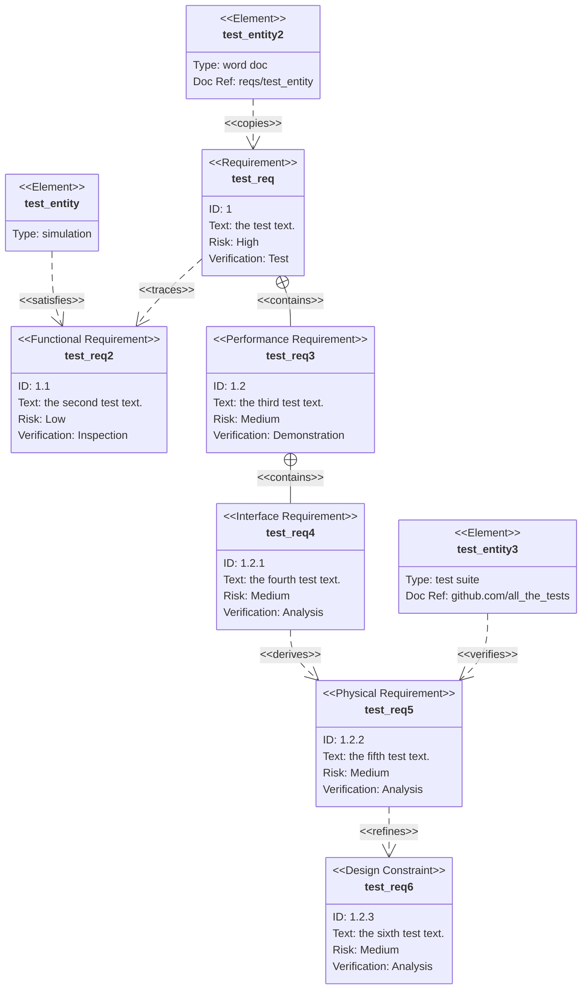

原文: <https://github.com/mermaid-js/mermaid/blob/develop/docs/requirementDiagram.md>

## 需求图

> 需求图提供了需求及其相互之间和其他记录元素之间的联系的可视化。 建模规范遵循 SysML v1.6 定义的规范。
>
> A Requirement diagram provides a visualization for requirements and their connections, to each other and other documented elements. The modeling specs follow those defined by SysML v1.6.

渲染要求很简单。

Rendering requirements is straightforward.


requirementDiagram

requirement test_req {
id: 1
text: the test text.
risk: high
verifymethod: test
}

element test_entity {
type: simulation
}

test_entity - satisfies -> test_req




### 语法

需求图包含三种类型的组件：需求、元素和关系。

There are three types of components to a requirement diagram: requirement, element, and relationship.

定义每个的语法定义如下。 尖括号中表示的单词，例如 `<word>`，是枚举关键字，在表格中详细说明了选项。 `user_defined_...` 用于任何需要用户输入的地方。

The grammar for defining each is defined below. Words denoted in angle brackets, such as ```<word>```, are enumerated keywords that have options elaborated in a table. ```user_defined_...``` is use in any place where user input is expected.

关于用户文本的重要说明：所有输入都可以用引号括起来，也可以不括起来。 例如， `Id: "here is an example"` 和 `Id: here is an example` 都是有效的。 但是，用户必须小心未引用的输入。 如果检测到另一个关键字，解析器将失败。

An important note on user text: all input can be surrounded in quotes or not. For example, both ```Id: "here is an example"``` and ```Id: here is an example``` are both valid. However, users must be careful with unquoted input. The parser will fail if another keyword is detected.

#### 需求

需求定义包含需求类型、名称、id、文本、风险和验证方法。 语法如下：

A requirement definition contains a requirement type, name, id, text, risk, and verification method. The syntax follows:

```text
<type> user_defined_name {
    id: user_defined_id
    text: user_defined text
    risk: <risk>
    verifymethod: <method>
}
```

类型、风险和方法是 SysML 中定义的枚举。

Type, risk, and method are enumerations defined in SysML.

| 关键字             | 可选项                                                                                                                  |
| ------------------ | ----------------------------------------------------------------------------------------------------------------------- |
| Type               | requirement, functionalRequirement, interfaceRequirement, performanceRequirement, physicalRequirement, designConstraint |
| Risk               | Low, Medium, High                                                                                                       |
| VerificationMethod | Analysis, Inspection, Test, Demonstration                                                                               |

#### 元素

元素定义包含元素名称、类型和文档引用。 这三个都是用户定义的。 元素功能旨在轻量级，但允许将需求连接到其他文档的部分。

An element definition contains an element name, type, and document reference. These three are all user defined. The element feature is intended to be lightweight but allow requirements to be connected to portions of other documents.

```text
element user_defined_name {
    type: user_defined_type
    docref: user_defined_ref
}
```

#### 关系

关系由源节点、目标节点和关系类型组成。

Relationships are comprised of a source node, destination node, and relationship type.

每个都遵循的定义格式

Each follows the definition format of

```text 格式
{name of source} - <type> -> {name of destination}
```

or

```text 格式
{name of destination} <- <type> - {name of source}
```

“源名称”和“目标名称”应该是在别处定义的需求或元素节点的名称。

"name of source" and "name of destination" should be names of requirement or element nodes defined elsewhere.

关系类型可以是包含、复制、派生、满足、验证、细化或跟踪之一。

A relationship type can be one of contains, copies, derives, satisfies, verifies, refines, or traces.

每个关系都在图中进行了标记。

Each relationship is labeled in the diagram.

### 例子

此示例使用图表的所有功能。

This example uses all features of the diagram.


requirementDiagram

requirement test_req {
id: 1
text: the test text.
risk: high
verifymethod: test
}

functionalRequirement test_req2 {
id: 1.1
text: the second test text.
risk: low
verifymethod: inspection
}

performanceRequirement test_req3 {
id: 1.2
text: the third test text.
risk: medium
verifymethod: demonstration
}

interfaceRequirement test_req4 {
id: 1.2.1
text: the fourth test text.
risk: medium
verifymethod: analysis
}

physicalRequirement test_req5 {
id: 1.2.2
text: the fifth test text.
risk: medium
verifymethod: analysis
}

designConstraint test_req6 {
id: 1.2.3
text: the sixth test text.
risk: medium
verifymethod: analysis
}

element test_entity {
type: simulation
}

element test_entity2 {
type: word doc
docRef: reqs/test_entity
}

element test_entity3 {
type: "test suite"
docRef: github.com/all_the_tests
}

test_entity - satisfies -> test_req2
test_req - traces -> test_req2
test_req - contains -> test_req3
test_req3 - contains -> test_req4
test_req4 - derives -> test_req5
test_req5 - refines -> test_req6
test_entity3 - verifies -> test_req5
test_req <- copies - test_entity2



