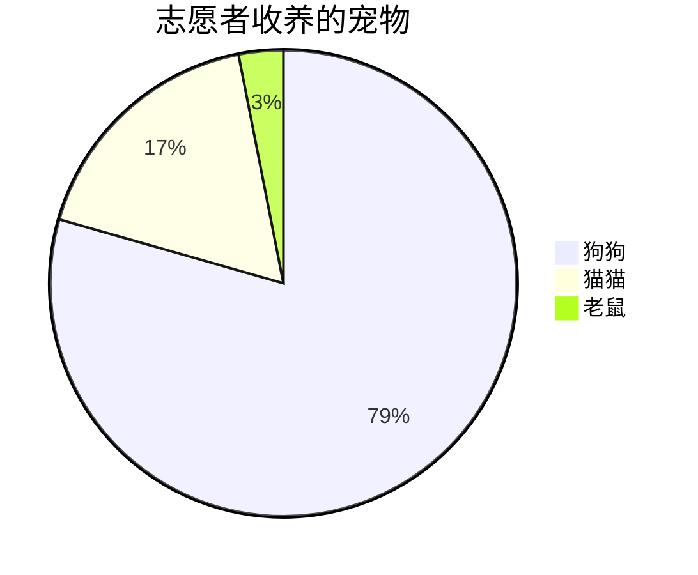
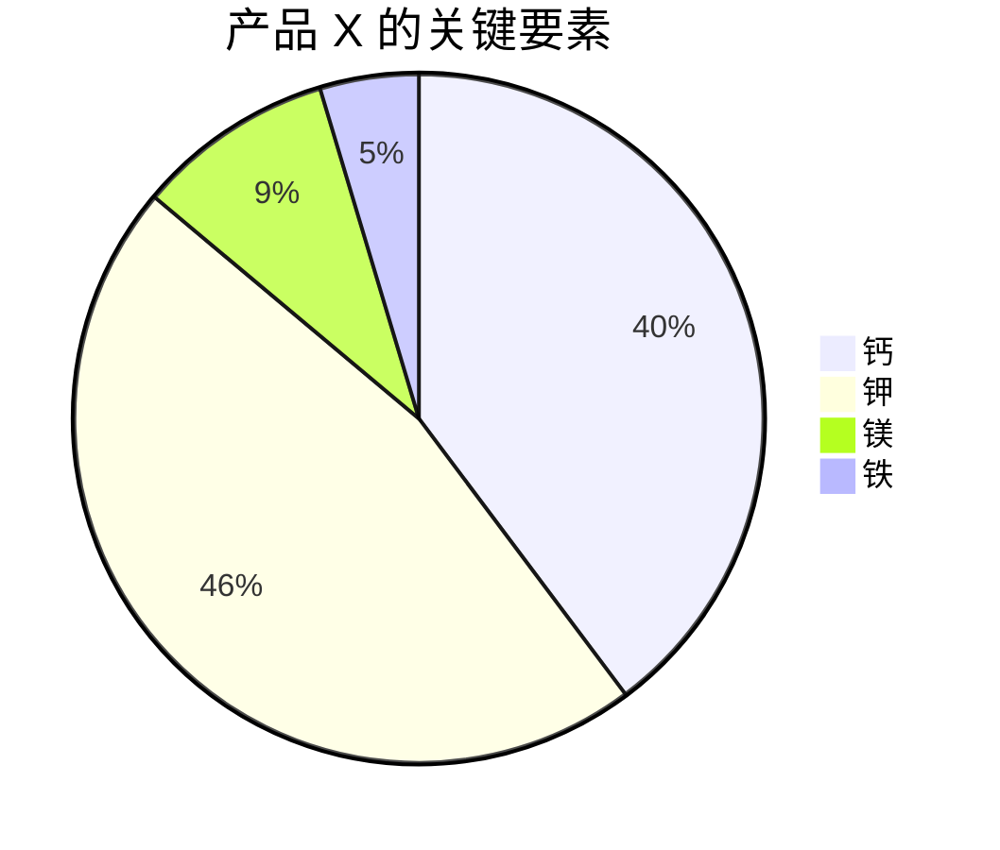

## 饼图

> 饼图（或圆图）是一种圆形统计图形，它被分成多个切片来说明数字比例。 在饼图中，每个切片的弧长（及其中心角和面积）与其代表的数量成正比。 虽然它因其类似于切片的馅饼而得名，但它的呈现方式有多种变化。 已知最早的饼图通常归功于威廉·普莱费尔 (William Playfair) 的 1801 年统计简报 - 维基百科
>
> A pie chart (or a circle chart) is a circular statistical graphic, which is divided into slices to illustrate numerical proportion. In a pie chart, the arc length of each slice (and consequently its central angle and area), is proportional to the quantity it represents. While it is named for its resemblance to a pie which has been sliced, there are variations on the way it can be presented. The earliest known pie chart is generally credited to William Playfair's Statistical Breviary of 1801 -Wikipedia

Mermaid can render Pie Chart diagrams.


pie title 志愿者收养的宠物
    "狗狗" : 386
    "猫猫" : 85
    "老鼠" : 15




### 语法

Drawing a pie chart is really simple in mermaid.

- Start with `pie` keyword to begin the diagram
- Followed by `title` keyword and its value in string to give a title to the pie-chart. This is ***OPTIONAL***
- Followed by dataSet
    - `label` for a section in the pie diagram within `" "` quotes.
    - Followed by `:` colon as separator
    - Followed by `positive numeric value` (supported upto two decimal places)

```text
[pie]
     [title] [titlevalue]  (OPTIONAL)
      "[datakey1]" : [dataValue1]
      "[datakey2]" : [dataValue2]
      "[datakey3]" : [dataValue3]
      .
      .
```

### 样例


pie
    title 产品 X 的关键要素
    "钙" : 42.96
    "钾" : 50.05
    "镁" : 10.01
    "铁" : 5



