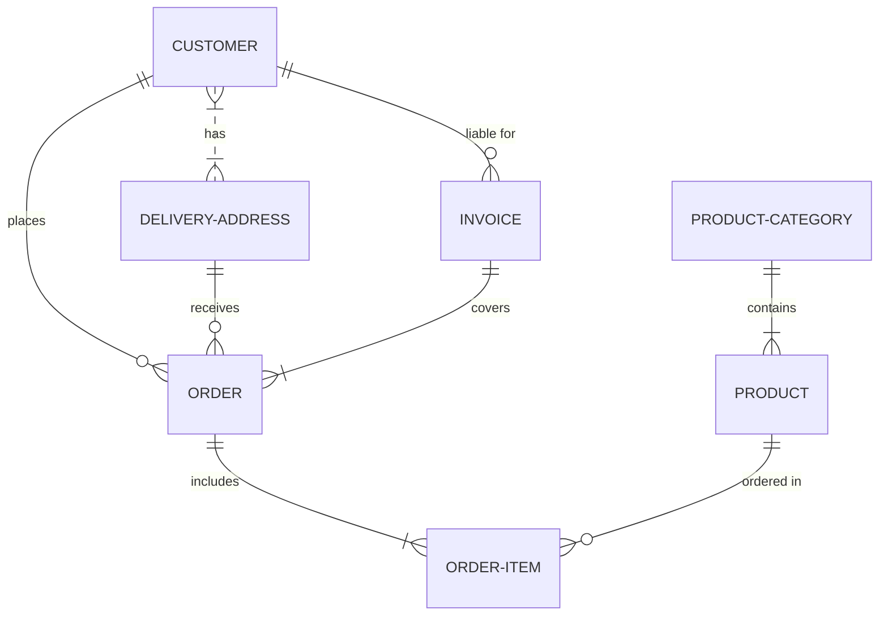

## 图表 语法

Mermaid 的语法用于创建图表。 你会发现它并不太难，一天就能学会。 下一节将深入探讨每种图表类型的语法。

语法与部署和配置一起构成了Mermaid的整体。

图表示例可以在[Mermaid在线编辑器][Mermaid在线编辑器]中找到，这也是一个很好的练习领域。

[Mermaid在线编辑器]: https://mermaid-js.github.io/mermaid-live-editor "Mermaid在线编辑器"

### 语法 结构

人们会注意到所有`图表定义`都以`图表类型的声明`开始，然后是图表及其内容的定义。 这个声明通知解析器代码应该生成哪种图表。

**例子** :  下面的代码用于**实体关系图**，由 `erDiagram` 声明指定。 下面是其中表示的不同`实体`的定义。

[快速开始][快速开始]部分同样提供了一些Mermaid语法的实际示例。

[快速开始]: /2021/12/21/mermaid文档中文版-快速开始.html "Getting Started"

### 图表分解

人们应该**注意使用一些可能会破坏图表的词或符号**。 这些词或符号很少，通常只影响特定类型的图表。 下表将不断更新。

| 图表截断符                     | 理由                                | 解决方案                        |
| ------------------------------ | ----------------------------------- | ------------------------------- |
| **注释**                       |                                     |                                 |
| [`%%{``}%%`][breaking-comment] | 类似于[指令][指令]会混淆渲染器。    | 注释中使用 `%%`, 避免使用 "{}". |
| **流程图**                     |                                     |                                 |
| 'end'                          | “end”这个词会导致流程图和序列图破裂 | 将它们用引号括起来以防止破损。  |
| [嵌套节点][Nodes-in-nodes] | Mermaid 对嵌套形状感到困惑          | 用引号将它们括起来以防止损坏    |

[breaking-comment]: https://github.com/mermaid-js/mermaid/issues/1968 "comment"
[指令]: https://github.com/mermaid-js/mermaid/blob/develop/docs/directives.md "Directives"
[主题]: https://github.com/mermaid-js/mermaid/blob/develop/docs/theming.md "Theming"
[Nodes-in-nodes]: https://mermaid-js.github.io/mermaid/#/flowchart?id=special-characters-that-break-syntax "Nodes in Nodes"

#### Mermaid 在线编辑

现在，您已经看到了不应添加到图表中的内容，您可以在 [Mermaid 实时编辑器][Mermaid在线编辑器]中使用它们。

## 配置

配置是Mermaid的第三部分，在部署和语法之后。 它处理Mermaid可以在不同部署中定制的不同方式。

如果您有兴趣更改和自定义您的Mermaid图，您将在此处找到可用于[配置](https://github.com/mermaid-js/mermaid/blob/develop/docs/Setup.md)的方法和值。 它包括主题。

本节将介绍配置Mermaid图的行为和外观的不同方法。 以下是最常用的方法，它们都与Mermaid[部署][快速开始]方法相关联。

### [在线编辑器][Mermaid在线编辑器] 中的配置

您可以在此处编辑某些值以更改图表的行为和外观。

### [initialize() 调用](/2021/12/21/mermaid文档中文版-快速开始.html#3-调用-Javascript-API)

在通过 API 或通过 `<script>` 标签调用 Mermaid 时使用。

### [指令][指令]

允许在渲染图之前对其进行有限的重新配置。 它可以改变图表的字体样式、颜色和其他美学方面。 您可以在 `%%{ }%%` 中与您的定义一起传递指令。 它可以在图表定义的上方或下方完成。

### [更改主题][主题]

使用指令更改应用程序的[主题][主题]。 主题 是 Mermaid 配置中的一个值，它规定了图表的配色方案。
